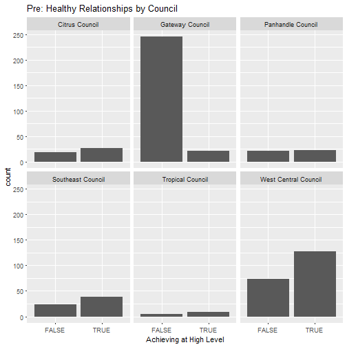
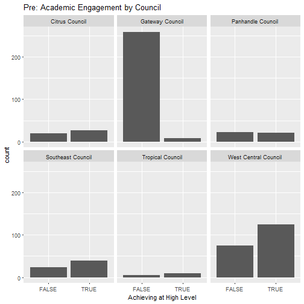
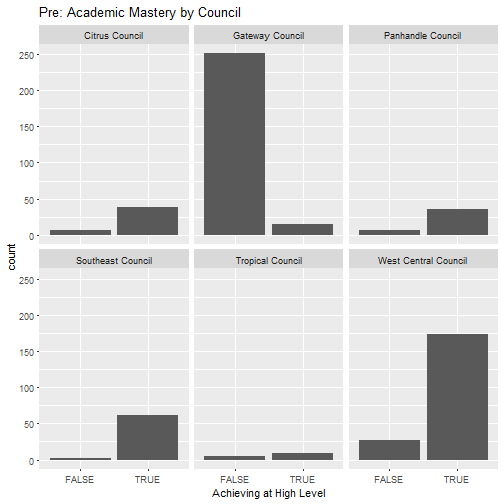
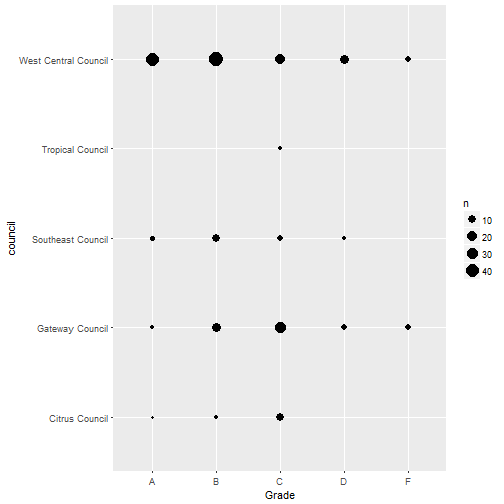
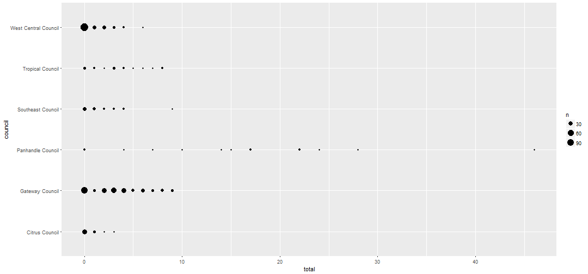

Council Data Summary
========================================================
author: Kevin Gilds, MPA
date: January 29, 2017
autosize: true

Healhty Relationship Student Survey
========================================================
Count of students achieving at a high level at baseline

|                     | FALSE| TRUE|
|:--------------------|-----:|----:|
|Citrus Council       |    19|   27|
|Gateway Council      |   246|   21|
|Panhandle Council    |    21|   22|
|Southeast Council    |    24|   39|
|Tropical Council     |     5|    9|
|West Central Council |    73|  127|

***

Healthy Relationships Parent Survey
========================================================
Right:80%

She develops positive relationships with her classmates 

***

Healthy Relationships Teacher Survey
========================================================
Right:80%

She has developed positive relationships with her classmates

***

Academic Engagment Student Survey
========================================================
Count of students achieving at a high level at baseline

|                     | FALSE| TRUE|
|:--------------------|-----:|----:|
|Citrus Council       |    22|   24|
|Gateway Council      |   245|   22|
|Panhandle Council    |    23|   20|
|Southeast Council    |    24|   39|
|Tropical Council     |    13|    1|
|West Central Council |   112|   88|

***

Academic Engagement Parent Survey
========================================================
Right:80%

Question 6: She works on her homework at home without supervision

***

Academic Engagement Teacher Survey
========================================================
Right:80%

Question 5: She positively participates in class

Question 6: She completes the homework given to her

***

Academic Mastery Student Survey
========================================================
Count of students achieving at a high level at baseline

|                     | FALSE| TRUE|
|:--------------------|-----:|----:|
|Citrus Council       |     7|   39|
|Gateway Council      |   252|   15|
|Panhandle Council    |     7|   36|
|Southeast Council    |     2|   61|
|Tropical Council     |     5|    9|
|West Central Council |    27|  173|

***

Academic Mastery Parent Survey
========================================================
Right:80%

Question 1: She is motivated to graduate high school

Question 3: She has a Good Attitude About School

***

Academic Mastery Teacher Survey
========================================================
Right:80%

Question 1: She is motivated to graduate high school

Question 3: She has a Good Attitude About School.

***

Language Arts Grades
========================================================

|                     |  A|  B|   C|  D|  F|
|:--------------------|--:|--:|---:|--:|--:|
|Citrus Council       | 13| 10|  11|  1|  0|
|Gateway Council      | 16| 82| 119| 50|  6|
|Panhandle Council    |  1|  7|   3|  3|  1|
|Southeast Council    | 10| 21|   9|  0|  0|
|Tropical Council     |  4|  8|   5|  2|  3|
|West Central Council | 95| 50|  12|  2|  0|

***

Reading Grades
========================================================

|                     |  A|  B|  C|  D|  F|
|:--------------------|--:|--:|--:|--:|--:|
|Citrus Council       |  1|  2| 10|  0|  0|
|Gateway Council      |  2| 18| 29|  5|  4|
|Southeast Council    |  3| 10|  6|  2|  0|
|Tropical Council     |  0|  0|  2|  0|  0|
|West Central Council | 44| 47| 21| 15|  4|

***

Attendance
========================================================

Total of excused and unexcused absences

Behavior
========================================================

Total of in-school suspensions and out-of-school suspensions

|                     |   0|  1|  2|  3|  4|  5|
|:--------------------|---:|--:|--:|--:|--:|--:|
|Citrus Council       |  45|  0|  0|  0|  0|  0|
|Gateway Council      | 217| 19| 16|  7|  6|  7|
|Panhandle Council    |  15|  0|  0|  0|  0|  0|
|Southeast Council    |  40|  0|  0|  0|  0|  0|
|Tropical Council     |  22|  0|  0|  0|  0|  0|
|West Central Council | 157|  2|  0|  0|  0|  0|

***

