results
================
Kevin Gilds, MPA
December 21, 2016

Objective Assessment: Data analysis and indication of progress towards achieving each objective
===============================================================================================

Life Skills
-----------

*Objective --70% of participating girls will demonstrate an increased understanding of pertinent life skills as demonstrated by a pre and post assessment.*

The surveys administered to the students measures the following life skills, healthy relationships, academic engagement, and academic mastery.

• Healthy Relationships--Measures relationship skills with peers and adults.

• Academic Engagement--Measures specific behaviors related to school success.

• Academic Mastery--Measures attitude toward education.

The questions and the scoring methodology of the girl survey were developed and tested by the Girl Scout Research Institute. Girls answer multiple questions to obtain an outcome score for each life skill domain. Responses to survey questions are assigned numbers/points and outcome scores are calculated by averaging responses to survey questions for each category. The points for each outcome set are averaged to obtain an outcome score. Outcome cutpoints are determined by the number of questions in the outcome set and response options. Outcomes scores range from 0-6. Below is a breakdown of the cut-points by the outcomes measured. Outcome cut-points are used to determine high achievement. Below is a breakdown of the cutpoints by the outcomes measured.

### Cutpoints

<table style="width:44%;">
<colgroup>
<col width="30%" />
<col width="13%" />
</colgroup>
<thead>
<tr class="header">
<th align="center">outcome</th>
<th align="center">criteria</th>
</tr>
</thead>
<tbody>
<tr class="odd">
<td align="center">Healthy Relationships</td>
<td align="center">4.45</td>
</tr>
<tr class="even">
<td align="center">Academic Mastery</td>
<td align="center">4.8</td>
</tr>
<tr class="odd">
<td align="center">Academic Engagement</td>
<td align="center">4.5</td>
</tr>
</tbody>
</table>

### Pre Survey and Quarter 1 Academic Data Results

The analysis below breaks down the pre survey results by life skills outcome including cross validation of parent and teacher pre surveys. The analysis below also provides baseline data of Quarter 1 Academic and school behavior data. The parent and teacher survey support evidence from the student surveys.

Healthy Relationship Outcome
============================

Relationship skills are a critical component of success in all realms of life. The healthy relationship questions measures the behaviors and attitudes of the respondent regarding their relationship skills. Questions that measure healthy relationships skills include the following:

*Healthy Relationship Questions*

1.  If I have a serious problem, I have people to talk with.
2.  I let people know if they have hurt my feelings.
3.  I let my friends know when I think they are good at something.
4.  In any relationship - romantic or not - I make it clear when I don't feel comfortable.

Pre Survey Analysis
-------------------

The number of valid surveys entered is **633**, and the number of students achieving at a high level is **245** and that equates to **38.7%**. The average score from students is **3.9**

### Healthy Relationship Outcome Achievement by Council

<table style="width:60%;">
<colgroup>
<col width="37%" />
<col width="11%" />
<col width="11%" />
</colgroup>
<thead>
<tr class="header">
<th align="center"> </th>
<th align="center">FALSE</th>
<th align="center">TRUE</th>
</tr>
</thead>
<tbody>
<tr class="odd">
<td align="center"><strong>Citrus Council</strong></td>
<td align="center">41.3</td>
<td align="center">58.7</td>
</tr>
<tr class="even">
<td align="center"><strong>Gateway Council</strong></td>
<td align="center">92.13</td>
<td align="center">7.87</td>
</tr>
<tr class="odd">
<td align="center"><strong>Panhandle Council</strong></td>
<td align="center">48.84</td>
<td align="center">51.16</td>
</tr>
<tr class="even">
<td align="center"><strong>Southeast Council</strong></td>
<td align="center">38.1</td>
<td align="center">61.9</td>
</tr>
<tr class="odd">
<td align="center"><strong>Tropical Council</strong></td>
<td align="center">35.71</td>
<td align="center">64.29</td>
</tr>
<tr class="even">
<td align="center"><strong>West Central Council</strong></td>
<td align="center">36.5</td>
<td align="center">63.5</td>
</tr>
</tbody>
</table>

\`\`\`

<table style="width:68%;">
<colgroup>
<col width="9%" />
<col width="13%" />
<col width="12%" />
<col width="9%" />
<col width="13%" />
<col width="8%" />
</colgroup>
<thead>
<tr class="header">
<th align="center">Min.</th>
<th align="center">1st Qu.</th>
<th align="center">Median</th>
<th align="center">Mean</th>
<th align="center">3rd Qu.</th>
<th align="center">Max.</th>
</tr>
</thead>
<tbody>
<tr class="odd">
<td align="center">0</td>
<td align="center">3.15</td>
<td align="center">3.9</td>
<td align="center">3.899</td>
<td align="center">4.875</td>
<td align="center">6</td>
</tr>
</tbody>
</table>

-   **Citrus Council**:

    <table style="width:68%;">
    <colgroup>
    <col width="9%" />
    <col width="13%" />
    <col width="12%" />
    <col width="9%" />
    <col width="13%" />
    <col width="8%" />
    </colgroup>
    <thead>
    <tr class="header">
    <th align="center">Min.</th>
    <th align="center">1st Qu.</th>
    <th align="center">Median</th>
    <th align="center">Mean</th>
    <th align="center">3rd Qu.</th>
    <th align="center">Max.</th>
    </tr>
    </thead>
    <tbody>
    <tr class="odd">
    <td align="center">0.875</td>
    <td align="center">3.906</td>
    <td align="center">4.725</td>
    <td align="center">4.642</td>
    <td align="center">5.906</td>
    <td align="center">6</td>
    </tr>
    </tbody>
    </table>

-   **Gateway Council**:

    <table style="width:68%;">
    <colgroup>
    <col width="9%" />
    <col width="13%" />
    <col width="12%" />
    <col width="9%" />
    <col width="13%" />
    <col width="8%" />
    </colgroup>
    <thead>
    <tr class="header">
    <th align="center">Min.</th>
    <th align="center">1st Qu.</th>
    <th align="center">Median</th>
    <th align="center">Mean</th>
    <th align="center">3rd Qu.</th>
    <th align="center">Max.</th>
    </tr>
    </thead>
    <tbody>
    <tr class="odd">
    <td align="center">0</td>
    <td align="center">2.65</td>
    <td align="center">3.15</td>
    <td align="center">3.045</td>
    <td align="center">3.65</td>
    <td align="center">6</td>
    </tr>
    </tbody>
    </table>

-   **Panhandle Council**:

    <table style="width:68%;">
    <colgroup>
    <col width="9%" />
    <col width="13%" />
    <col width="12%" />
    <col width="9%" />
    <col width="13%" />
    <col width="8%" />
    </colgroup>
    <thead>
    <tr class="header">
    <th align="center">Min.</th>
    <th align="center">1st Qu.</th>
    <th align="center">Median</th>
    <th align="center">Mean</th>
    <th align="center">3rd Qu.</th>
    <th align="center">Max.</th>
    </tr>
    </thead>
    <tbody>
    <tr class="odd">
    <td align="center">0.375</td>
    <td align="center">3.475</td>
    <td align="center">4.45</td>
    <td align="center">4.272</td>
    <td align="center">5.512</td>
    <td align="center">6</td>
    </tr>
    </tbody>
    </table>

-   **Southeast Council**:

    <table style="width:68%;">
    <colgroup>
    <col width="9%" />
    <col width="13%" />
    <col width="12%" />
    <col width="9%" />
    <col width="13%" />
    <col width="8%" />
    </colgroup>
    <thead>
    <tr class="header">
    <th align="center">Min.</th>
    <th align="center">1st Qu.</th>
    <th align="center">Median</th>
    <th align="center">Mean</th>
    <th align="center">3rd Qu.</th>
    <th align="center">Max.</th>
    </tr>
    </thead>
    <tbody>
    <tr class="odd">
    <td align="center">1.175</td>
    <td align="center">3.788</td>
    <td align="center">4.9</td>
    <td align="center">4.64</td>
    <td align="center">5.625</td>
    <td align="center">6</td>
    </tr>
    </tbody>
    </table>

-   **Tropical Council**:

    <table style="width:68%;">
    <colgroup>
    <col width="9%" />
    <col width="13%" />
    <col width="12%" />
    <col width="9%" />
    <col width="13%" />
    <col width="8%" />
    </colgroup>
    <thead>
    <tr class="header">
    <th align="center">Min.</th>
    <th align="center">1st Qu.</th>
    <th align="center">Median</th>
    <th align="center">Mean</th>
    <th align="center">3rd Qu.</th>
    <th align="center">Max.</th>
    </tr>
    </thead>
    <tbody>
    <tr class="odd">
    <td align="center">2.375</td>
    <td align="center">3.675</td>
    <td align="center">4.675</td>
    <td align="center">4.425</td>
    <td align="center">5.288</td>
    <td align="center">5.7</td>
    </tr>
    </tbody>
    </table>

-   **West Central Council**:

    <table style="width:68%;">
    <colgroup>
    <col width="9%" />
    <col width="13%" />
    <col width="12%" />
    <col width="9%" />
    <col width="13%" />
    <col width="8%" />
    </colgroup>
    <thead>
    <tr class="header">
    <th align="center">Min.</th>
    <th align="center">1st Qu.</th>
    <th align="center">Median</th>
    <th align="center">Mean</th>
    <th align="center">3rd Qu.</th>
    <th align="center">Max.</th>
    </tr>
    </thead>
    <tbody>
    <tr class="odd">
    <td align="center">0.375</td>
    <td align="center">3.988</td>
    <td align="center">4.662</td>
    <td align="center">4.516</td>
    <td align="center">5.5</td>
    <td align="center">6</td>
    </tr>
    </tbody>
    </table>

<!-- end of list -->
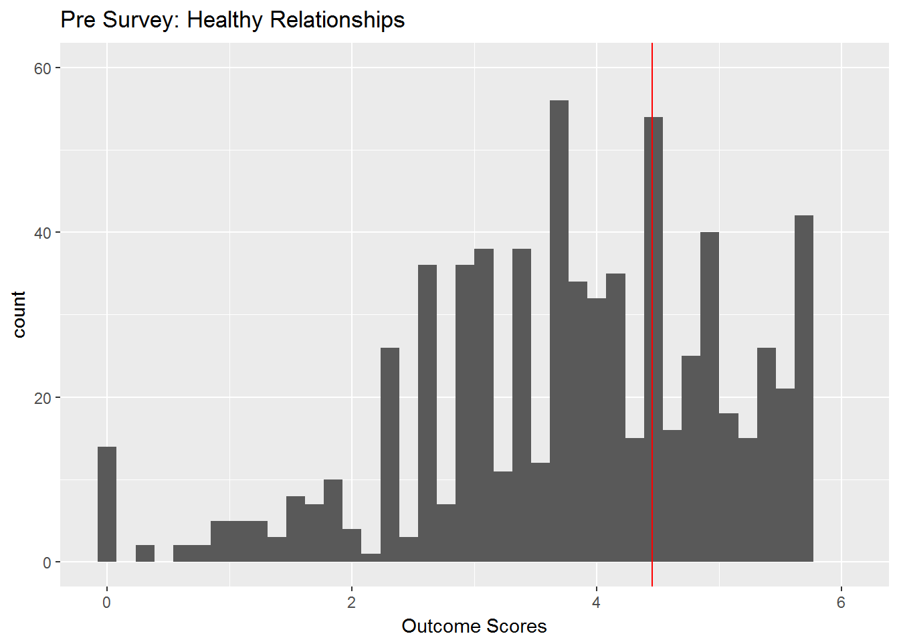

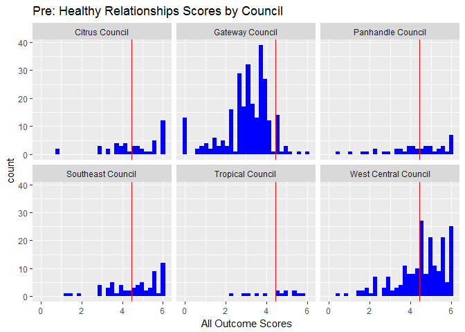

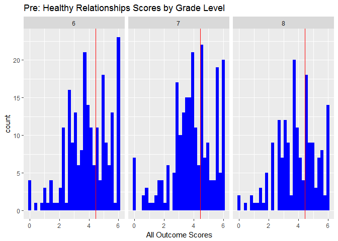

Pre Survey: Healthy Relationship History
========================================

<table style="width:63%;">
<colgroup>
<col width="9%" />
<col width="18%" />
<col width="26%" />
<col width="8%" />
</colgroup>
<thead>
<tr class="header">
<th align="center">Year</th>
<th align="center">population</th>
<th align="center">percent_achieved</th>
<th align="center">mean</th>
</tr>
</thead>
<tbody>
<tr class="odd">
<td align="center">2013</td>
<td align="center">699</td>
<td align="center">61%</td>
<td align="center">4.55</td>
</tr>
<tr class="even">
<td align="center">2014</td>
<td align="center">1186</td>
<td align="center">61%</td>
<td align="center">4.44</td>
</tr>
<tr class="odd">
<td align="center">2015</td>
<td align="center">844</td>
<td align="center">59%</td>
<td align="center">4.41</td>
</tr>
</tbody>
</table>

Cross Validation of Healthy Relationship Skills
-----------------------------------------------

Survey results from teachers and parents also provide useful baseline data to gauge life skills. Below are tables and graphs that provide a breakdown of questions on the pre survey from the parent and teacher surveys.

### Pre Parent Survey

**Question 5: She develops positive relationships with her classmates.** N=520

| Item |       low|   neutral|      high|  mean|       sd|
|:-----|---------:|---------:|---------:|-----:|--------:|
| Q5   |  7.307692|  19.42308|  73.26923|  5.25|  1.33249|

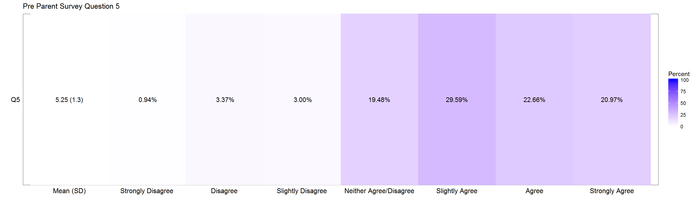

| Group                | Item |        low|    neutral|       high|      mean|        sd|
|:---------------------|:-----|----------:|----------:|----------:|---------:|---------:|
| Citrus Council       | Q5   |   0.000000|   0.000000|  100.00000|  6.000000|  1.414214|
| Gateway Council      | Q5   |   7.450980|  36.078431|   56.47059|  4.647059|  1.000463|
| Panhandle Council    | Q5   |  10.526316|   5.263158|   84.21053|  5.894737|  1.486784|
| Southeast Council    | Q5   |   5.970149|   2.985075|   91.04478|  5.746269|  1.210350|
| Tropical Council     | Q5   |  14.285714|   0.000000|   85.71429|  5.142857|  2.035401|
| West Central Council | Q5   |   7.058823|   3.529412|   89.41176|  5.882353|  1.370974|

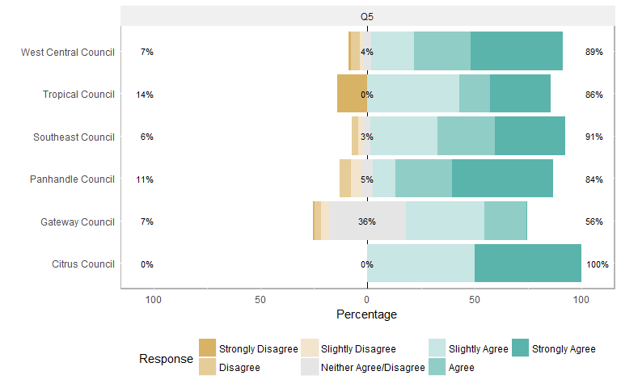

### Teacher Survey

**Question 7: She has developed positive relationships with her classmates.** N=360

| Item |       low|   neutral|      high|   mean|        sd|
|:-----|---------:|---------:|---------:|------:|---------:|
| Q7   |  10.55556|  27.77778|  61.66667|  4.925|  1.315194|

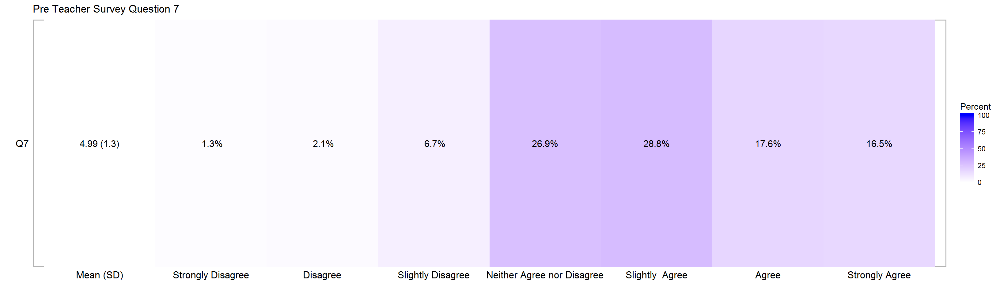

| Group                | Item |        low|    neutral|       high|      mean|         sd|
|:---------------------|:-----|----------:|----------:|----------:|---------:|----------:|
| Citrus Council       | Q7   |  50.000000|   0.000000|   50.00000|  5.000000|  2.8284271|
| Gateway Council      | Q7   |  13.492064|  38.888889|   47.61905|  4.380952|  1.0048261|
| Panhandle Council    | Q7   |   5.555556|   0.000000|   94.44444|  6.222222|  1.0032627|
| Southeast Council    | Q7   |   0.000000|   1.886793|   98.11321|  6.396226|  0.7426466|
| Tropical Council     | Q7   |   0.000000|   0.000000|  100.00000|  6.200000|  0.8366600|
| West Central Council | Q7   |   6.666667|   3.333333|   90.00000|  5.900000|  1.3733925|

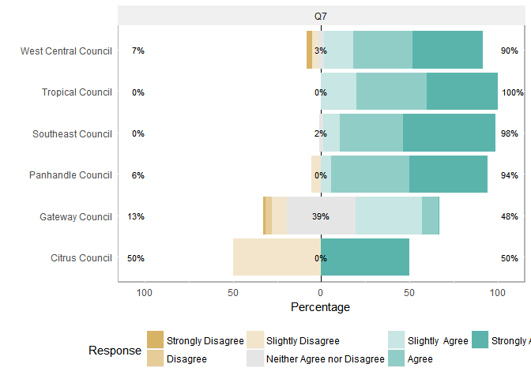

### Healthy Relationship Analysis

The pre survey result indicates that the students in the program do not have strong relationship skills as compared to past years and this is a potential growth area for the students. Typically 61 percent of the students come into this program with strong healthy relationship skills whereas this year it was under 40 percent.

Parent and teacher survey support the evidence from the students surveys. Nearly three-quarters of parents either indicated high agreement that their child had positive relationship at school. Following the student survey pattern, this is a 10 percent decrease from the pre survey last year. Nearly two-thirds of teachers havea a high agreement that the students have developed positive relationships.

Reviewing the distribution of pre surveys scores indicates that 172 students are between 3.45 and the 4.45 cutpoint. The healthy relationship outcome skill is a strong point for the Get REAL! program as evidenced by previous years. Last year 26 percent of students improved from a low skill level to a high skill level and over 85 percent had success with this outcome.

Academic Engagement Outcome
===========================

Academic engagement questions gauge tangible behaviors that help students succeed in school. Questions that measure academic engagement include the following.

**Acadeimc Engagement Questions**

1.  I talk with my teachers before or after school, or during lunch about my assignments.
2.  I hand in my assignments on time
3.  I finish my homework even if it is boring
4.  If I can't understand my schoolwork at first, I keep trying until I do understand it.

Pre Survey Analysis
-------------------

The number of valid surveys entered is **633**, and the number of students achieving at a high level is **194** and that equates to **19.91%**. The average score from students is **3.66**

### Academic Engagement Outcome Achievement by Council

<table style="width:60%;">
<colgroup>
<col width="37%" />
<col width="11%" />
<col width="11%" />
</colgroup>
<thead>
<tr class="header">
<th align="center"> </th>
<th align="center">FALSE</th>
<th align="center">TRUE</th>
</tr>
</thead>
<tbody>
<tr class="odd">
<td align="center"><strong>Citrus Council</strong></td>
<td align="center">47.83</td>
<td align="center">52.17</td>
</tr>
<tr class="even">
<td align="center"><strong>Gateway Council</strong></td>
<td align="center">91.76</td>
<td align="center">8.24</td>
</tr>
<tr class="odd">
<td align="center"><strong>Panhandle Council</strong></td>
<td align="center">53.49</td>
<td align="center">46.51</td>
</tr>
<tr class="even">
<td align="center"><strong>Southeast Council</strong></td>
<td align="center">38.1</td>
<td align="center">61.9</td>
</tr>
<tr class="odd">
<td align="center"><strong>Tropical Council</strong></td>
<td align="center">92.86</td>
<td align="center">7.14</td>
</tr>
<tr class="even">
<td align="center"><strong>West Central Council</strong></td>
<td align="center">56</td>
<td align="center">44</td>
</tr>
</tbody>
</table>

### Academic Engagement: Pre Outcome Score Summary & Council Summary

<table style="width:68%;">
<colgroup>
<col width="9%" />
<col width="13%" />
<col width="12%" />
<col width="9%" />
<col width="13%" />
<col width="8%" />
</colgroup>
<thead>
<tr class="header">
<th align="center">Min.</th>
<th align="center">1st Qu.</th>
<th align="center">Median</th>
<th align="center">Mean</th>
<th align="center">3rd Qu.</th>
<th align="center">Max.</th>
</tr>
</thead>
<tbody>
<tr class="odd">
<td align="center">0</td>
<td align="center">3</td>
<td align="center">3.75</td>
<td align="center">3.663</td>
<td align="center">4.5</td>
<td align="center">6</td>
</tr>
</tbody>
</table>

-   **Citrus Council**:

    <table style="width:68%;">
    <colgroup>
    <col width="9%" />
    <col width="13%" />
    <col width="12%" />
    <col width="9%" />
    <col width="13%" />
    <col width="8%" />
    </colgroup>
    <thead>
    <tr class="header">
    <th align="center">Min.</th>
    <th align="center">1st Qu.</th>
    <th align="center">Median</th>
    <th align="center">Mean</th>
    <th align="center">3rd Qu.</th>
    <th align="center">Max.</th>
    </tr>
    </thead>
    <tbody>
    <tr class="odd">
    <td align="center">0</td>
    <td align="center">3.375</td>
    <td align="center">4.5</td>
    <td align="center">4.255</td>
    <td align="center">5.25</td>
    <td align="center">6</td>
    </tr>
    </tbody>
    </table>

-   **Gateway Council**:

    <table style="width:68%;">
    <colgroup>
    <col width="9%" />
    <col width="13%" />
    <col width="12%" />
    <col width="9%" />
    <col width="13%" />
    <col width="8%" />
    </colgroup>
    <thead>
    <tr class="header">
    <th align="center">Min.</th>
    <th align="center">1st Qu.</th>
    <th align="center">Median</th>
    <th align="center">Mean</th>
    <th align="center">3rd Qu.</th>
    <th align="center">Max.</th>
    </tr>
    </thead>
    <tbody>
    <tr class="odd">
    <td align="center">0</td>
    <td align="center">3</td>
    <td align="center">3</td>
    <td align="center">3.077</td>
    <td align="center">3.75</td>
    <td align="center">5.625</td>
    </tr>
    </tbody>
    </table>

-   **Panhandle Council**:

    <table style="width:68%;">
    <colgroup>
    <col width="9%" />
    <col width="13%" />
    <col width="12%" />
    <col width="9%" />
    <col width="13%" />
    <col width="8%" />
    </colgroup>
    <thead>
    <tr class="header">
    <th align="center">Min.</th>
    <th align="center">1st Qu.</th>
    <th align="center">Median</th>
    <th align="center">Mean</th>
    <th align="center">3rd Qu.</th>
    <th align="center">Max.</th>
    </tr>
    </thead>
    <tbody>
    <tr class="odd">
    <td align="center">1.5</td>
    <td align="center">3</td>
    <td align="center">4.125</td>
    <td align="center">3.959</td>
    <td align="center">4.688</td>
    <td align="center">6</td>
    </tr>
    </tbody>
    </table>

-   **Southeast Council**:

    <table style="width:68%;">
    <colgroup>
    <col width="9%" />
    <col width="13%" />
    <col width="12%" />
    <col width="9%" />
    <col width="13%" />
    <col width="8%" />
    </colgroup>
    <thead>
    <tr class="header">
    <th align="center">Min.</th>
    <th align="center">1st Qu.</th>
    <th align="center">Median</th>
    <th align="center">Mean</th>
    <th align="center">3rd Qu.</th>
    <th align="center">Max.</th>
    </tr>
    </thead>
    <tbody>
    <tr class="odd">
    <td align="center">1.875</td>
    <td align="center">3.75</td>
    <td align="center">4.5</td>
    <td align="center">4.536</td>
    <td align="center">5.25</td>
    <td align="center">6</td>
    </tr>
    </tbody>
    </table>

-   **Tropical Council**:

    <table style="width:68%;">
    <colgroup>
    <col width="9%" />
    <col width="13%" />
    <col width="12%" />
    <col width="9%" />
    <col width="13%" />
    <col width="8%" />
    </colgroup>
    <thead>
    <tr class="header">
    <th align="center">Min.</th>
    <th align="center">1st Qu.</th>
    <th align="center">Median</th>
    <th align="center">Mean</th>
    <th align="center">3rd Qu.</th>
    <th align="center">Max.</th>
    </tr>
    </thead>
    <tbody>
    <tr class="odd">
    <td align="center">2.625</td>
    <td align="center">3</td>
    <td align="center">3.375</td>
    <td align="center">3.429</td>
    <td align="center">3.75</td>
    <td align="center">5.25</td>
    </tr>
    </tbody>
    </table>

-   **West Central Council**:

    <table style="width:68%;">
    <colgroup>
    <col width="9%" />
    <col width="13%" />
    <col width="12%" />
    <col width="9%" />
    <col width="13%" />
    <col width="8%" />
    </colgroup>
    <thead>
    <tr class="header">
    <th align="center">Min.</th>
    <th align="center">1st Qu.</th>
    <th align="center">Median</th>
    <th align="center">Mean</th>
    <th align="center">3rd Qu.</th>
    <th align="center">Max.</th>
    </tr>
    </thead>
    <tbody>
    <tr class="odd">
    <td align="center">0.375</td>
    <td align="center">3.375</td>
    <td align="center">4.125</td>
    <td align="center">3.986</td>
    <td align="center">4.875</td>
    <td align="center">6</td>
    </tr>
    </tbody>
    </table>

<!-- end of list -->
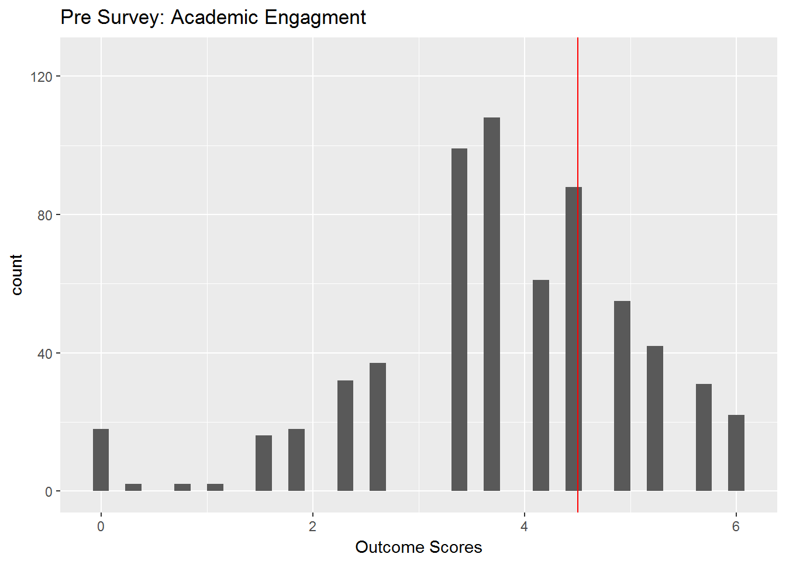

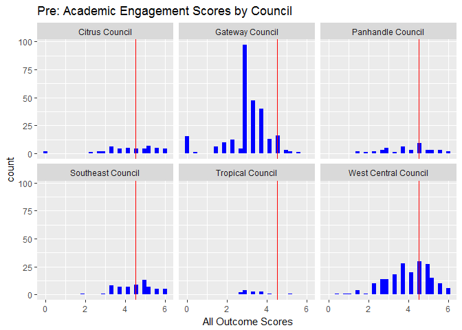

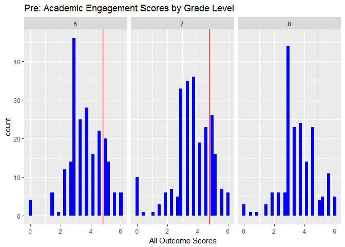

Pre Survey: Academic Engagement History
=======================================

<table style="width:63%;">
<colgroup>
<col width="9%" />
<col width="18%" />
<col width="26%" />
<col width="8%" />
</colgroup>
<thead>
<tr class="header">
<th align="center">Year</th>
<th align="center">population</th>
<th align="center">percent_achieved</th>
<th align="center">mean</th>
</tr>
</thead>
<tbody>
<tr class="odd">
<td align="center">2013</td>
<td align="center">699</td>
<td align="center">46.92%</td>
<td align="center">4.1</td>
</tr>
<tr class="even">
<td align="center">2014</td>
<td align="center">1186</td>
<td align="center">40.05%</td>
<td align="center">3.82</td>
</tr>
<tr class="odd">
<td align="center">2015</td>
<td align="center">642</td>
<td align="center">40.46%</td>
<td align="center">4.24</td>
</tr>
</tbody>
</table>

Cross Validation of Academic Engagment Skills
---------------------------------------------

Survey results from teachers and parents also provide useful baseline data to gauge life skills. Below are tables and graphs that provide a breakdown of questions on the pre survey from the parent and teacher surveys.

### Pre Parent Survey

**Question 6: She works on her homework at home without supervision.** N=520

| Item |       low|   neutral|      high|      mean|        sd|
|:-----|---------:|---------:|---------:|---------:|---------:|
| Q6   |  3.653846|  16.73077|  79.61538|  5.592308|  1.261227|

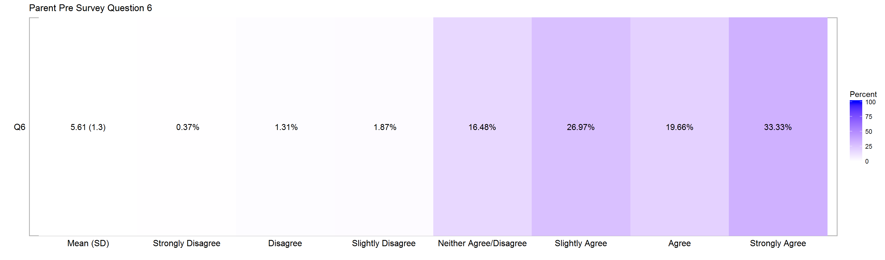

| Group                | Item |       low|    neutral|       high|      mean|         sd|
|:---------------------|:-----|---------:|----------:|----------:|---------:|----------:|
| Citrus Council       | Q6   |  0.000000|   0.000000|  100.00000|  7.000000|  0.0000000|
| Gateway Council      | Q6   |  3.529412|  31.372549|   65.09804|  4.788235|  0.8707059|
| Panhandle Council    | Q6   |  5.263158|   5.263158|   89.47368|  5.842105|  1.1186876|
| Southeast Council    | Q6   |  1.492537|   1.492537|   97.01493|  6.373134|  0.9017797|
| Tropical Council     | Q6   |  0.000000|   0.000000|  100.00000|  6.428571|  0.7867958|
| West Central Council | Q6   |  4.705882|   2.941177|   92.35294|  6.411765|  1.1491609|

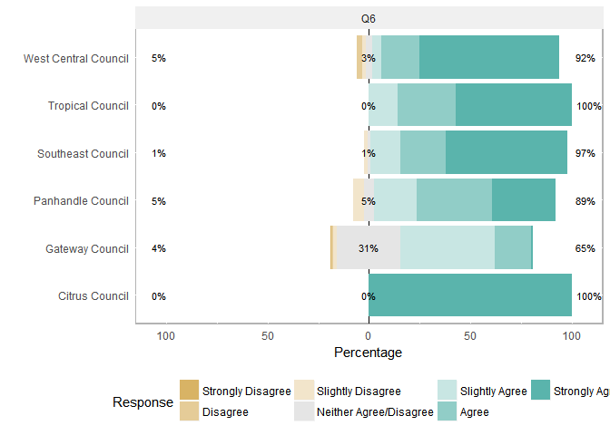

### Teacher Survey

**Question 5: She positively participates in class.** N= 360

**Question 6: She completes the homework given to her.** N= 360

<table style="width:72%;">
<colgroup>
<col width="11%" />
<col width="9%" />
<col width="8%" />
<col width="13%" />
<col width="9%" />
<col width="9%" />
<col width="9%" />
</colgroup>
<thead>
<tr class="header">
<th align="left"> </th>
<th align="center">Item</th>
<th align="center">low</th>
<th align="center">neutral</th>
<th align="center">high</th>
<th align="center">mean</th>
<th align="center">sd</th>
</tr>
</thead>
<tbody>
<tr class="odd">
<td align="left"><strong>2</strong></td>
<td align="center">Q6</td>
<td align="center">10.58</td>
<td align="center">27.3</td>
<td align="center">62.12</td>
<td align="center">4.955</td>
<td align="center">1.298</td>
</tr>
<tr class="even">
<td align="left"><strong>1</strong></td>
<td align="center">Q5</td>
<td align="center">12.78</td>
<td align="center">32.22</td>
<td align="center">55</td>
<td align="center">4.733</td>
<td align="center">1.35</td>
</tr>
</tbody>
</table>

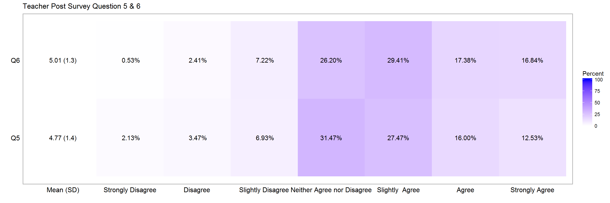

| Group                | Item |        low|    neutral|       high|      mean|         sd|
|:---------------------|:-----|----------:|----------:|----------:|---------:|----------:|
| Citrus Council       | Q5   |   0.000000|   0.000000|  100.00000|  7.000000|  0.0000000|
| Citrus Council       | Q6   |   0.000000|   0.000000|  100.00000|  6.500000|  0.7071068|
| Gateway Council      | Q5   |  13.095238|  45.238095|   41.66667|  4.297619|  0.9418947|
| Gateway Council      | Q6   |  13.944223|  38.247012|   47.80876|  4.390438|  0.9833352|
| Panhandle Council    | Q5   |   5.555556|   0.000000|   94.44444|  6.222222|  1.3956047|
| Panhandle Council    | Q6   |   0.000000|   0.000000|  100.00000|  6.333333|  0.6859943|
| Southeast Council    | Q5   |   5.660377|   3.773585|   90.56604|  5.905660|  1.2749683|
| Southeast Council    | Q6   |   0.000000|   0.000000|  100.00000|  6.528302|  0.6386215|
| Tropical Council     | Q5   |  20.000000|   0.000000|   80.00000|  5.600000|  1.6733201|
| Tropical Council     | Q6   |   0.000000|   0.000000|  100.00000|  6.000000|  0.7071068|
| West Central Council | Q5   |  26.666667|   0.000000|   73.33333|  5.133333|  2.0633641|
| West Central Council | Q6   |  10.000000|   6.666667|   83.33333|  5.800000|  1.3493293|

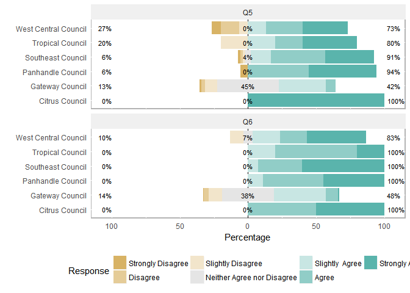

### Analysis Academic Engagment

Students in the Get REAL! program typically do not come into the program with a high academic engagement scores. This year is no different but the outcomes scores are much lower than expected. Typically around 40 percent of students come to the program with solid academic behaviors but this year it was 20 percent.

Parent and teacher pre surveys support evidence from the student survey. Pre teacher surveys indicate about 60 percent believe the student positively participates in class. A little more than half of teachers agreed that the student completes home work given to her. More than three-quarters of parents had high agreement that their child does school work without supervision. However, this is nearly a 10 percent decrease from the pre survey results last year.

This life skill outcome presents another growth opportunity for the students. Reviewing the outcome distribution 137 students are between 3.45 and the cutpoint for achieving this outcome at a high level. Last year 80 percent of students had a positive outcome, and a quarter of the students went from low achievement to high achievement.

Academic Mastery Outcome
========================

Academic mastery questions gauge a student's attitude towards school and education. Questions that measure Academic Mastery include the following.

-   It's important to me that I improve my skills this year in school
-   It's important to me that I really understand my class work
-   Learning at school is important to me
-   One of my goals in school is to learn as much as I can
-   The things I am learning in school will help me later in life

Pre Survey Analysis
-------------------

The number of valid surveys entered is **633**, and the number of students achieving at a high level is **333** and that equates to **52.61%**. The average score from students is **4.51**

### Academic Mastery Outcome Achievement by Council

<table style="width:60%;">
<colgroup>
<col width="37%" />
<col width="11%" />
<col width="11%" />
</colgroup>
<thead>
<tr class="header">
<th align="center"> </th>
<th align="center">FALSE</th>
<th align="center">TRUE</th>
</tr>
</thead>
<tbody>
<tr class="odd">
<td align="center"><strong>Citrus Council</strong></td>
<td align="center">15.22</td>
<td align="center">84.78</td>
</tr>
<tr class="even">
<td align="center"><strong>Gateway Council</strong></td>
<td align="center">94.38</td>
<td align="center">5.62</td>
</tr>
<tr class="odd">
<td align="center"><strong>Panhandle Council</strong></td>
<td align="center">16.28</td>
<td align="center">83.72</td>
</tr>
<tr class="even">
<td align="center"><strong>Southeast Council</strong></td>
<td align="center">3.17</td>
<td align="center">96.83</td>
</tr>
<tr class="odd">
<td align="center"><strong>Tropical Council</strong></td>
<td align="center">35.71</td>
<td align="center">64.29</td>
</tr>
<tr class="even">
<td align="center"><strong>West Central Council</strong></td>
<td align="center">13.5</td>
<td align="center">86.5</td>
</tr>
</tbody>
</table>

### Academic Mastery: Pre Outcome Summary & Council Summary

<table style="width:68%;">
<colgroup>
<col width="9%" />
<col width="13%" />
<col width="12%" />
<col width="9%" />
<col width="13%" />
<col width="8%" />
</colgroup>
<thead>
<tr class="header">
<th align="center">Min.</th>
<th align="center">1st Qu.</th>
<th align="center">Median</th>
<th align="center">Mean</th>
<th align="center">3rd Qu.</th>
<th align="center">Max.</th>
</tr>
</thead>
<tbody>
<tr class="odd">
<td align="center">0</td>
<td align="center">3.6</td>
<td align="center">4.8</td>
<td align="center">4.508</td>
<td align="center">5.76</td>
<td align="center">6</td>
</tr>
</tbody>
</table>

-   **Citrus Council**:

    <table style="width:68%;">
    <colgroup>
    <col width="9%" />
    <col width="13%" />
    <col width="12%" />
    <col width="9%" />
    <col width="13%" />
    <col width="8%" />
    </colgroup>
    <thead>
    <tr class="header">
    <th align="center">Min.</th>
    <th align="center">1st Qu.</th>
    <th align="center">Median</th>
    <th align="center">Mean</th>
    <th align="center">3rd Qu.</th>
    <th align="center">Max.</th>
    </tr>
    </thead>
    <tbody>
    <tr class="odd">
    <td align="center">1.68</td>
    <td align="center">5.1</td>
    <td align="center">5.52</td>
    <td align="center">5.353</td>
    <td align="center">6</td>
    <td align="center">6</td>
    </tr>
    </tbody>
    </table>

-   **Gateway Council**:

    <table style="width:68%;">
    <colgroup>
    <col width="9%" />
    <col width="13%" />
    <col width="12%" />
    <col width="9%" />
    <col width="13%" />
    <col width="8%" />
    </colgroup>
    <thead>
    <tr class="header">
    <th align="center">Min.</th>
    <th align="center">1st Qu.</th>
    <th align="center">Median</th>
    <th align="center">Mean</th>
    <th align="center">3rd Qu.</th>
    <th align="center">Max.</th>
    </tr>
    </thead>
    <tbody>
    <tr class="odd">
    <td align="center">0</td>
    <td align="center">2.88</td>
    <td align="center">3.36</td>
    <td align="center">3.276</td>
    <td align="center">4.08</td>
    <td align="center">6</td>
    </tr>
    </tbody>
    </table>

-   **Panhandle Council**:

    <table style="width:68%;">
    <colgroup>
    <col width="9%" />
    <col width="13%" />
    <col width="12%" />
    <col width="9%" />
    <col width="13%" />
    <col width="8%" />
    </colgroup>
    <thead>
    <tr class="header">
    <th align="center">Min.</th>
    <th align="center">1st Qu.</th>
    <th align="center">Median</th>
    <th align="center">Mean</th>
    <th align="center">3rd Qu.</th>
    <th align="center">Max.</th>
    </tr>
    </thead>
    <tbody>
    <tr class="odd">
    <td align="center">3.6</td>
    <td align="center">4.8</td>
    <td align="center">5.52</td>
    <td align="center">5.313</td>
    <td align="center">5.76</td>
    <td align="center">6</td>
    </tr>
    </tbody>
    </table>

-   **Southeast Council**:

    <table style="width:68%;">
    <colgroup>
    <col width="9%" />
    <col width="13%" />
    <col width="12%" />
    <col width="9%" />
    <col width="13%" />
    <col width="8%" />
    </colgroup>
    <thead>
    <tr class="header">
    <th align="center">Min.</th>
    <th align="center">1st Qu.</th>
    <th align="center">Median</th>
    <th align="center">Mean</th>
    <th align="center">3rd Qu.</th>
    <th align="center">Max.</th>
    </tr>
    </thead>
    <tbody>
    <tr class="odd">
    <td align="center">3.84</td>
    <td align="center">5.52</td>
    <td align="center">5.76</td>
    <td align="center">5.718</td>
    <td align="center">6</td>
    <td align="center">6</td>
    </tr>
    </tbody>
    </table>

-   **Tropical Council**:

    <table style="width:68%;">
    <colgroup>
    <col width="9%" />
    <col width="13%" />
    <col width="12%" />
    <col width="9%" />
    <col width="13%" />
    <col width="8%" />
    </colgroup>
    <thead>
    <tr class="header">
    <th align="center">Min.</th>
    <th align="center">1st Qu.</th>
    <th align="center">Median</th>
    <th align="center">Mean</th>
    <th align="center">3rd Qu.</th>
    <th align="center">Max.</th>
    </tr>
    </thead>
    <tbody>
    <tr class="odd">
    <td align="center">3.6</td>
    <td align="center">4.14</td>
    <td align="center">5.04</td>
    <td align="center">4.989</td>
    <td align="center">5.76</td>
    <td align="center">6</td>
    </tr>
    </tbody>
    </table>

-   **West Central Council**:

    <table style="width:68%;">
    <colgroup>
    <col width="9%" />
    <col width="13%" />
    <col width="12%" />
    <col width="9%" />
    <col width="13%" />
    <col width="8%" />
    </colgroup>
    <thead>
    <tr class="header">
    <th align="center">Min.</th>
    <th align="center">1st Qu.</th>
    <th align="center">Median</th>
    <th align="center">Mean</th>
    <th align="center">3rd Qu.</th>
    <th align="center">Max.</th>
    </tr>
    </thead>
    <tbody>
    <tr class="odd">
    <td align="center">1.44</td>
    <td align="center">5.04</td>
    <td align="center">5.52</td>
    <td align="center">5.371</td>
    <td align="center">6</td>
    <td align="center">6</td>
    </tr>
    </tbody>
    </table>

<!-- end of list -->
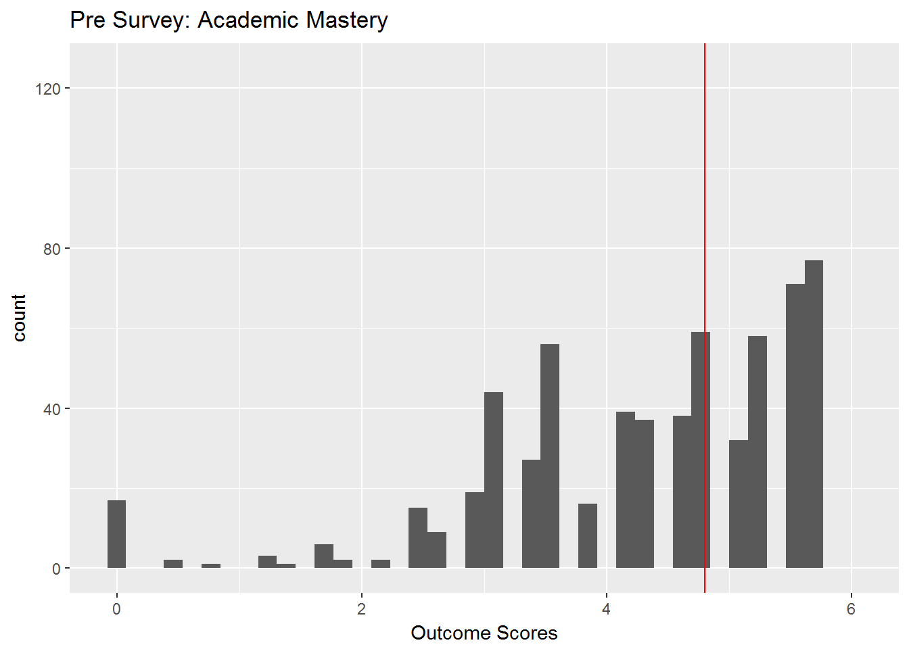

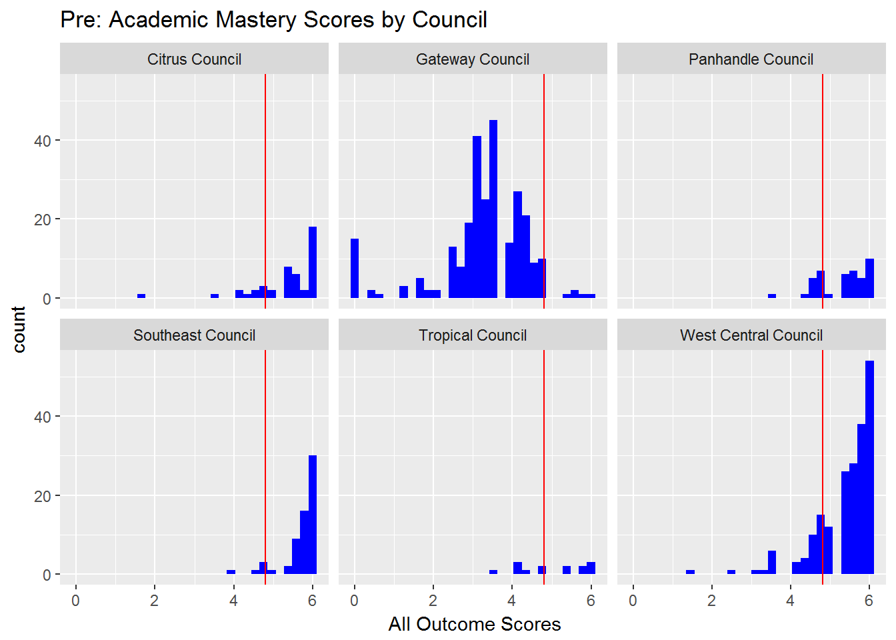

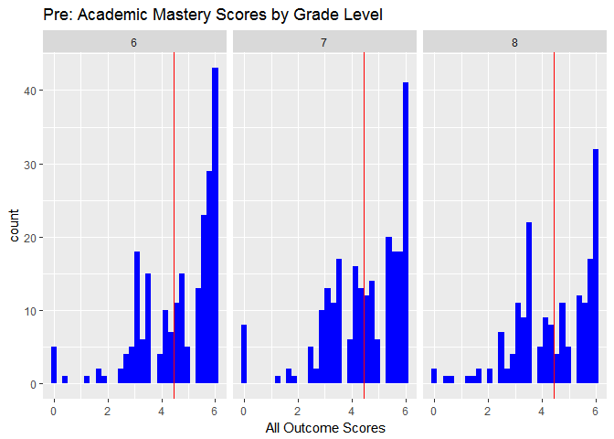

Pre Survey: Academic Mastery History
====================================

<table style="width:63%;">
<colgroup>
<col width="9%" />
<col width="18%" />
<col width="26%" />
<col width="8%" />
</colgroup>
<thead>
<tr class="header">
<th align="center">Year</th>
<th align="center">population</th>
<th align="center">percent_achieved</th>
<th align="center">mean</th>
</tr>
</thead>
<tbody>
<tr class="odd">
<td align="center">2013</td>
<td align="center">699</td>
<td align="center">85.98%</td>
<td align="center">5.38</td>
</tr>
<tr class="even">
<td align="center">2014</td>
<td align="center">1186</td>
<td align="center">76.98%</td>
<td align="center">5.12</td>
</tr>
<tr class="odd">
<td align="center">2015</td>
<td align="center">642</td>
<td align="center">74.76%</td>
<td align="center">5.14</td>
</tr>
</tbody>
</table>

Cross Validation of Academic Mastery
------------------------------------

Survey results from teachers and parents also provide useful baseline data to gauge life skills. Below are tables and graphs that provide a breakdown of questions on the pre survey from the parent and teacher surveys.

Pre Parent Survey
-----------------

**Question 1: She is motivated to graduate high school.** N=520

**Question 3: She has a Good Attitude About School.** N=520

| Item |       low|   neutral|      high|      mean|        sd|
|:-----|---------:|---------:|---------:|---------:|---------:|
| Q1   |  1.153846|  17.50000|  81.34615|  5.888462|  1.201742|
| Q3   |  2.500000|  17.88462|  79.61538|  5.648077|  1.202597|

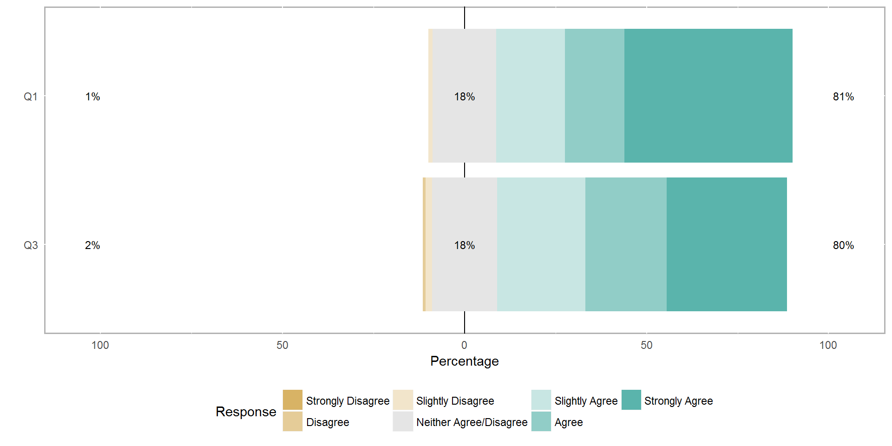

| Group                | Item |       low|     neutral|       high|      mean|         sd|
|:---------------------|:-----|---------:|-----------:|----------:|---------:|----------:|
| Citrus Council       | Q1   |  0.000000|   0.0000000|  100.00000|  7.000000|  0.0000000|
| Citrus Council       | Q3   |  0.000000|   0.0000000|  100.00000|  7.000000|  0.0000000|
| Gateway Council      | Q1   |  1.960784|  35.2941176|   62.74510|  4.909804|  0.9069406|
| Gateway Council      | Q3   |  3.921569|  34.9019608|   61.17647|  4.780392|  0.8822438|
| Panhandle Council    | Q1   |  0.000000|   0.0000000|  100.00000|  6.736842|  0.5619515|
| Panhandle Council    | Q3   |  0.000000|   5.2631579|   94.73684|  6.263158|  0.9334586|
| Southeast Council    | Q1   |  1.492537|   0.0000000|   98.50746|  6.776119|  0.6233073|
| Southeast Council    | Q3   |  1.492537|   0.0000000|   98.50746|  6.507463|  0.8233916|
| Tropical Council     | Q1   |  0.000000|   0.0000000|  100.00000|  6.857143|  0.3779645|
| Tropical Council     | Q3   |  0.000000|  14.2857143|   85.71429|  6.000000|  1.0000000|
| West Central Council | Q1   |  0.000000|   0.5882353|   99.41176|  6.858823|  0.4114613|
| West Central Council | Q3   |  1.176471|   1.1764706|   97.64706|  6.511765|  0.7937495|

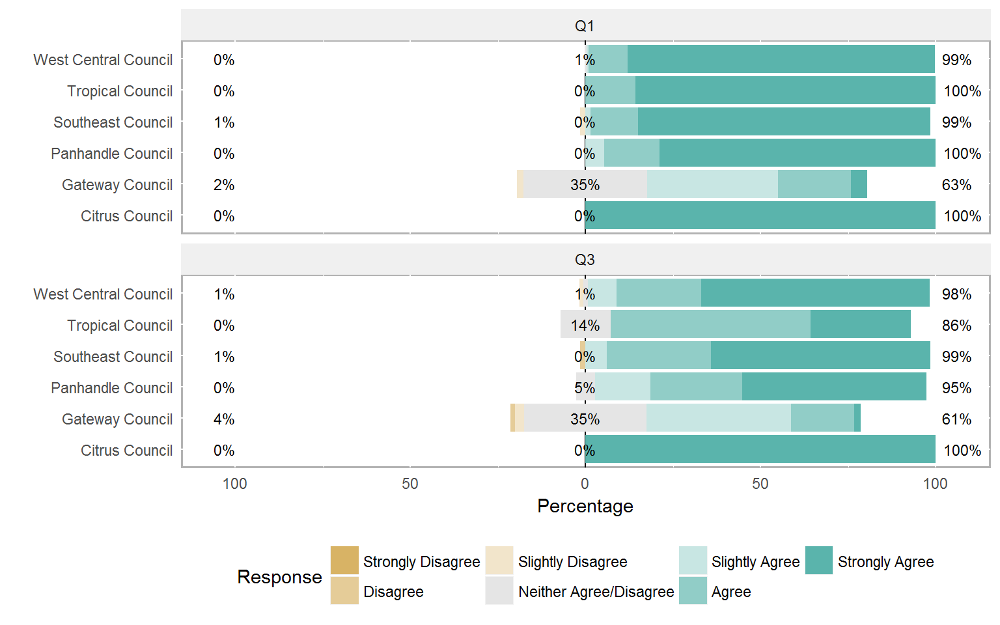

### Teacher Pre Survey

**Question 1: She is motivated to graduate high school.** N=360

**Question 3: She has a Good Attitude About School.** N=360

| Item |       low|   neutral|      high|      mean|        sd|
|:-----|---------:|---------:|---------:|---------:|---------:|
| Q1   |   7.50000|  37.22222|  55.27778|  4.969444|  1.308494|
| Q3   |  10.27778|  36.66667|  53.05556|  4.861111|  1.348739|

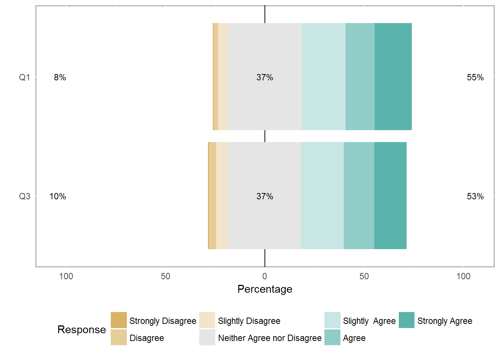

| Group                | Item |        low|    neutral|       high|      mean|         sd|
|:---------------------|:-----|----------:|----------:|----------:|---------:|----------:|
| Citrus Council       | Q1   |   0.000000|   0.000000|  100.00000|  7.000000|  0.0000000|
| Citrus Council       | Q3   |   0.000000|   0.000000|  100.00000|  7.000000|  0.0000000|
| Gateway Council      | Q1   |  10.317460|  52.777778|   36.90476|  4.317460|  0.8805177|
| Gateway Council      | Q3   |  11.904762|  51.984127|   36.11111|  4.301587|  0.9636405|
| Panhandle Council    | Q1   |   0.000000|   0.000000|  100.00000|  6.500000|  0.6183469|
| Panhandle Council    | Q3   |   5.555556|   0.000000|   94.44444|  6.222222|  1.0602750|
| Southeast Council    | Q1   |   0.000000|   0.000000|  100.00000|  6.584906|  0.5347164|
| Southeast Council    | Q3   |   0.000000|   1.886793|   98.11321|  6.471698|  0.6386215|
| Tropical Council     | Q1   |   0.000000|   0.000000|  100.00000|  6.800000|  0.4472136|
| Tropical Council     | Q3   |   0.000000|   0.000000|  100.00000|  5.600000|  0.5477226|
| West Central Council | Q1   |   3.333333|   3.333333|   93.33333|  6.233333|  1.1351237|
| West Central Council | Q3   |  20.000000|   0.000000|   80.00000|  5.633333|  1.8473342|

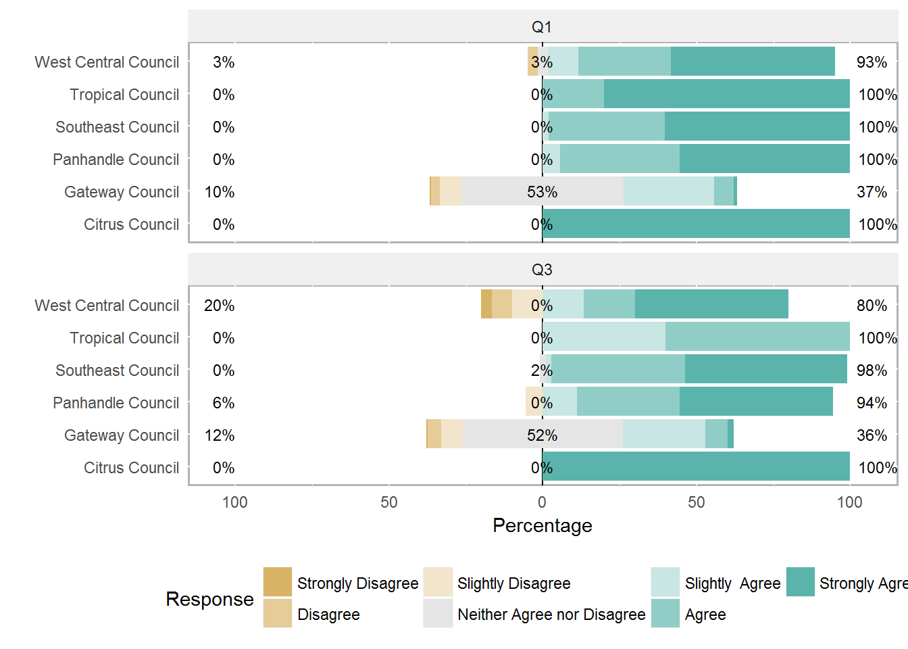

### Analysis Academic Mastery

The pre survey results indicate that the students have a moderately positive attitude towards education. However, students typically come into the program with a much better attitude towards education and school. Currently just over half of the students have a positive attitude toward school whereas in the past it in mid 70's.

Parent and teacher survey results are fairly consistent with the student surveys. Teacher survey results are more cautious in their agreement that the student has a good attitude towards education with about 55 percent in agreement. Parent surveys indicate a high level of agreement that the student has a positive attitude toward school with 80 percent in agreement. However,this is about a 10 percent decrease in level of agreement from last year.

The academic mastery life skill will be an interesting data point to follow. If attitudes toward education changes will other life skill outcomes will improve and will academic behavior be impacted. Currently 105 students have an outcome score that ranges from 3.8 to cutpoint from achieving the outcome at a high level. The Get REAL! program typically has not been in a position to increase this outcome. Academic Mastery is a foundation for other life skills and outcomes, a recommendation will be to emphasize the why of education to increase motivation.

Reading Improvement
===================

*Objective: 50% of participating students will improve their reading skills as demonstrated by their Language Arts grade increasing or maintaining a “C” grade from the baseline grading period to the final grading period as evidenced by report cards/school reports.*

The number of valid data entries is **544**. Students in the Get REAL! program are off to a good to start as 98% of the students have a C or higher in Language Arts course and are doing better than last year. However, it would be advisable to monitor grades closely as students are likely to regress over the 2nd quarter.

<table style="width:44%;">
<caption>Q1 Grades</caption>
<colgroup>
<col width="16%" />
<col width="5%" />
<col width="5%" />
<col width="5%" />
<col width="5%" />
<col width="5%" />
</colgroup>
<thead>
<tr class="header">
<th align="center"> </th>
<th align="center">A</th>
<th align="center">B</th>
<th align="center">C</th>
<th align="center">D</th>
<th align="center">F</th>
</tr>
</thead>
<tbody>
<tr class="odd">
<td align="center"><strong>16-17</strong></td>
<td align="center">139</td>
<td align="center">178</td>
<td align="center">159</td>
<td align="center">58</td>
<td align="center">10</td>
</tr>
</tbody>
</table>

<table style="width:65%;">
<caption>Q1 Grades by Council</caption>
<colgroup>
<col width="37%" />
<col width="5%" />
<col width="5%" />
<col width="5%" />
<col width="5%" />
<col width="5%" />
</colgroup>
<thead>
<tr class="header">
<th align="center"> </th>
<th align="center">A</th>
<th align="center">B</th>
<th align="center">C</th>
<th align="center">D</th>
<th align="center">F</th>
</tr>
</thead>
<tbody>
<tr class="odd">
<td align="center"><strong>Citrus Council</strong></td>
<td align="center">13</td>
<td align="center">10</td>
<td align="center">11</td>
<td align="center">1</td>
<td align="center">0</td>
</tr>
<tr class="even">
<td align="center"><strong>Gateway Council</strong></td>
<td align="center">16</td>
<td align="center">82</td>
<td align="center">119</td>
<td align="center">50</td>
<td align="center">6</td>
</tr>
<tr class="odd">
<td align="center"><strong>Panhandle Council</strong></td>
<td align="center">1</td>
<td align="center">7</td>
<td align="center">3</td>
<td align="center">3</td>
<td align="center">1</td>
</tr>
<tr class="even">
<td align="center"><strong>Southeast Council</strong></td>
<td align="center">10</td>
<td align="center">21</td>
<td align="center">9</td>
<td align="center">0</td>
<td align="center">0</td>
</tr>
<tr class="odd">
<td align="center"><strong>Tropical Council</strong></td>
<td align="center">4</td>
<td align="center">8</td>
<td align="center">5</td>
<td align="center">2</td>
<td align="center">3</td>
</tr>
<tr class="even">
<td align="center"><strong>West Central Council</strong></td>
<td align="center">95</td>
<td align="center">50</td>
<td align="center">12</td>
<td align="center">2</td>
<td align="center">0</td>
</tr>
</tbody>
</table>

<table style="width:65%;">
<caption>Q1:Language Arts Courses and Grades</caption>
<colgroup>
<col width="37%" />
<col width="5%" />
<col width="5%" />
<col width="5%" />
<col width="5%" />
<col width="5%" />
</colgroup>
<thead>
<tr class="header">
<th align="center"> </th>
<th align="center">A</th>
<th align="center">B</th>
<th align="center">C</th>
<th align="center">D</th>
<th align="center">F</th>
</tr>
</thead>
<tbody>
<tr class="odd">
<td align="center"><strong>ENGLISH</strong></td>
<td align="center">0</td>
<td align="center">1</td>
<td align="center">1</td>
<td align="center">0</td>
<td align="center">0</td>
</tr>
<tr class="even">
<td align="center"><strong>M/J LANG ARTS 1</strong></td>
<td align="center">31</td>
<td align="center">54</td>
<td align="center">42</td>
<td align="center">22</td>
<td align="center">2</td>
</tr>
<tr class="odd">
<td align="center"><strong>M/J LANG ARTS 1 ADV</strong></td>
<td align="center">21</td>
<td align="center">10</td>
<td align="center">2</td>
<td align="center">1</td>
<td align="center">0</td>
</tr>
<tr class="even">
<td align="center"><strong>M/J LANG ARTS 2</strong></td>
<td align="center">21</td>
<td align="center">51</td>
<td align="center">62</td>
<td align="center">20</td>
<td align="center">6</td>
</tr>
<tr class="odd">
<td align="center"><strong>M/J LANG ARTS 2 ADV</strong></td>
<td align="center">29</td>
<td align="center">9</td>
<td align="center">5</td>
<td align="center">0</td>
<td align="center">0</td>
</tr>
<tr class="even">
<td align="center"><strong>M/J LANG ARTS 2 ESOL</strong></td>
<td align="center">1</td>
<td align="center">0</td>
<td align="center">0</td>
<td align="center">0</td>
<td align="center">0</td>
</tr>
<tr class="odd">
<td align="center"><strong>M/J LANG ARTS 3</strong></td>
<td align="center">15</td>
<td align="center">40</td>
<td align="center">45</td>
<td align="center">15</td>
<td align="center">2</td>
</tr>
<tr class="even">
<td align="center"><strong>M/J LANG ARTS 3 ADv</strong></td>
<td align="center">21</td>
<td align="center">13</td>
<td align="center">2</td>
<td align="center">0</td>
<td align="center">0</td>
</tr>
</tbody>
</table>

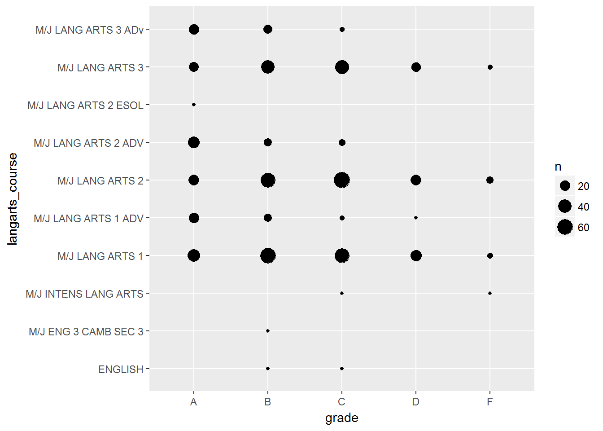

<table style="width:44%;">
<caption>Grade Table History--Quarter 1</caption>
<colgroup>
<col width="16%" />
<col width="5%" />
<col width="5%" />
<col width="5%" />
<col width="5%" />
<col width="5%" />
</colgroup>
<thead>
<tr class="header">
<th align="center"> </th>
<th align="center">A</th>
<th align="center">B</th>
<th align="center">C</th>
<th align="center">D</th>
<th align="center">F</th>
</tr>
</thead>
<tbody>
<tr class="odd">
<td align="center"><strong>15-16</strong></td>
<td align="center">132</td>
<td align="center">190</td>
<td align="center">173</td>
<td align="center">78</td>
<td align="center">26</td>
</tr>
<tr class="even">
<td align="center"><strong>16-17</strong></td>
<td align="center">139</td>
<td align="center">178</td>
<td align="center">159</td>
<td align="center">58</td>
<td align="center">10</td>
</tr>
</tbody>
</table>

<table style="width:24%;">
<caption>Quarter 1 GPA History</caption>
<colgroup>
<col width="9%" />
<col width="13%" />
</colgroup>
<thead>
<tr class="header">
<th align="center">Year</th>
<th align="center">lang_avg</th>
</tr>
</thead>
<tbody>
<tr class="odd">
<td align="center">15-16</td>
<td align="center">2.540902</td>
</tr>
<tr class="even">
<td align="center">16-17</td>
<td align="center">2.694853</td>
</tr>
</tbody>
</table>

<table style="width:53%;">
<caption>Quarter 1 GPA History by Council</caption>
<colgroup>
<col width="29%" />
<col width="9%" />
<col width="13%" />
</colgroup>
<thead>
<tr class="header">
<th align="center">council</th>
<th align="center">Year</th>
<th align="center">lang_avg</th>
</tr>
</thead>
<tbody>
<tr class="odd">
<td align="center">Citrus Council</td>
<td align="center">15-16</td>
<td align="center">2.954545</td>
</tr>
<tr class="even">
<td align="center">Citrus Council</td>
<td align="center">16-17</td>
<td align="center">3.000000</td>
</tr>
<tr class="odd">
<td align="center">Gateway Council</td>
<td align="center">15-16</td>
<td align="center">2.040590</td>
</tr>
<tr class="even">
<td align="center">Gateway Council</td>
<td align="center">16-17</td>
<td align="center">2.190476</td>
</tr>
<tr class="odd">
<td align="center">Panhandle Council</td>
<td align="center">15-16</td>
<td align="center">2.052632</td>
</tr>
<tr class="even">
<td align="center">Panhandle Council</td>
<td align="center">16-17</td>
<td align="center">2.266667</td>
</tr>
<tr class="odd">
<td align="center">Southeast Council</td>
<td align="center">15-16</td>
<td align="center">2.809091</td>
</tr>
<tr class="even">
<td align="center">Southeast Council</td>
<td align="center">16-17</td>
<td align="center">3.025000</td>
</tr>
<tr class="odd">
<td align="center">Tropical Council</td>
<td align="center">15-16</td>
<td align="center">2.846154</td>
</tr>
<tr class="even">
<td align="center">Tropical Council</td>
<td align="center">16-17</td>
<td align="center">2.363636</td>
</tr>
<tr class="odd">
<td align="center">West Central Council</td>
<td align="center">15-16</td>
<td align="center">3.197183</td>
</tr>
<tr class="even">
<td align="center">West Central Council</td>
<td align="center">16-17</td>
<td align="center">3.496855</td>
</tr>
</tbody>
</table>

The number of valid entries is **225** and 87 percent of the students have a C grade or higher in reading focused courses.

<table style="width:44%;">
<caption>Grade Table History--Quarter 1</caption>
<colgroup>
<col width="16%" />
<col width="5%" />
<col width="5%" />
<col width="5%" />
<col width="5%" />
<col width="5%" />
</colgroup>
<thead>
<tr class="header">
<th align="center"> </th>
<th align="center">A</th>
<th align="center">B</th>
<th align="center">C</th>
<th align="center">D</th>
<th align="center">F</th>
</tr>
</thead>
<tbody>
<tr class="odd">
<td align="center"><strong>16-17</strong></td>
<td align="center">50</td>
<td align="center">77</td>
<td align="center">68</td>
<td align="center">22</td>
<td align="center">8</td>
</tr>
</tbody>
</table>

<table style="width:65%;">
<caption>Q1 Grades by Council</caption>
<colgroup>
<col width="37%" />
<col width="5%" />
<col width="5%" />
<col width="5%" />
<col width="5%" />
<col width="5%" />
</colgroup>
<thead>
<tr class="header">
<th align="center"> </th>
<th align="center">A</th>
<th align="center">B</th>
<th align="center">C</th>
<th align="center">D</th>
<th align="center">F</th>
</tr>
</thead>
<tbody>
<tr class="odd">
<td align="center"><strong>Citrus Council</strong></td>
<td align="center">1</td>
<td align="center">2</td>
<td align="center">10</td>
<td align="center">0</td>
<td align="center">0</td>
</tr>
<tr class="even">
<td align="center"><strong>Gateway Council</strong></td>
<td align="center">2</td>
<td align="center">18</td>
<td align="center">29</td>
<td align="center">5</td>
<td align="center">4</td>
</tr>
<tr class="odd">
<td align="center"><strong>Southeast Council</strong></td>
<td align="center">3</td>
<td align="center">10</td>
<td align="center">6</td>
<td align="center">2</td>
<td align="center">0</td>
</tr>
<tr class="even">
<td align="center"><strong>Tropical Council</strong></td>
<td align="center">0</td>
<td align="center">0</td>
<td align="center">2</td>
<td align="center">0</td>
<td align="center">0</td>
</tr>
<tr class="odd">
<td align="center"><strong>West Central Council</strong></td>
<td align="center">44</td>
<td align="center">47</td>
<td align="center">21</td>
<td align="center">15</td>
<td align="center">4</td>
</tr>
</tbody>
</table>

<table style="width:64%;">
<caption>Q1:Reading Arts Courses and Grades</caption>
<colgroup>
<col width="36%" />
<col width="5%" />
<col width="5%" />
<col width="5%" />
<col width="5%" />
<col width="5%" />
</colgroup>
<thead>
<tr class="header">
<th align="center"> </th>
<th align="center">A</th>
<th align="center">B</th>
<th align="center">C</th>
<th align="center">D</th>
<th align="center">F</th>
</tr>
</thead>
<tbody>
<tr class="odd">
<td align="center"><strong>M/J INENS READ (MC)</strong></td>
<td align="center">5</td>
<td align="center">3</td>
<td align="center">2</td>
<td align="center">4</td>
<td align="center">0</td>
</tr>
<tr class="even">
<td align="center"><strong>M/J INTENS READ</strong></td>
<td align="center">17</td>
<td align="center">28</td>
<td align="center">17</td>
<td align="center">11</td>
<td align="center">1</td>
</tr>
<tr class="odd">
<td align="center"><strong>M/J READ 1</strong></td>
<td align="center">1</td>
<td align="center">12</td>
<td align="center">14</td>
<td align="center">2</td>
<td align="center">2</td>
</tr>
<tr class="even">
<td align="center"><strong>M/J READ 1, ADV</strong></td>
<td align="center">4</td>
<td align="center">4</td>
<td align="center">3</td>
<td align="center">0</td>
<td align="center">1</td>
</tr>
<tr class="odd">
<td align="center"><strong>M/J READ 2</strong></td>
<td align="center">3</td>
<td align="center">11</td>
<td align="center">23</td>
<td align="center">4</td>
<td align="center">2</td>
</tr>
<tr class="even">
<td align="center"><strong>M/J READ 2, ADV</strong></td>
<td align="center">7</td>
<td align="center">7</td>
<td align="center">2</td>
<td align="center">0</td>
<td align="center">1</td>
</tr>
<tr class="odd">
<td align="center"><strong>M/J READ 3</strong></td>
<td align="center">5</td>
<td align="center">8</td>
<td align="center">7</td>
<td align="center">1</td>
<td align="center">0</td>
</tr>
<tr class="even">
<td align="center"><strong>M/J READ3, ADV</strong></td>
<td align="center">8</td>
<td align="center">4</td>
<td align="center">0</td>
<td align="center">0</td>
<td align="center">1</td>
</tr>
</tbody>
</table>

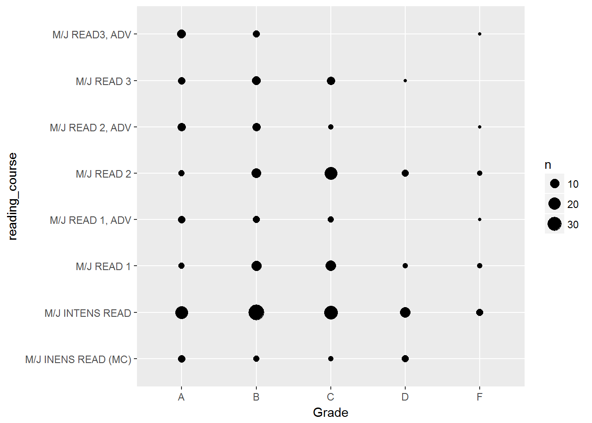

<table style="width:44%;">
<caption>Grade Table History--Quarter 1</caption>
<colgroup>
<col width="16%" />
<col width="5%" />
<col width="5%" />
<col width="5%" />
<col width="5%" />
<col width="5%" />
</colgroup>
<thead>
<tr class="header">
<th align="center"> </th>
<th align="center">A</th>
<th align="center">B</th>
<th align="center">C</th>
<th align="center">D</th>
<th align="center">F</th>
</tr>
</thead>
<tbody>
<tr class="odd">
<td align="center"><strong>15-16</strong></td>
<td align="center">38</td>
<td align="center">104</td>
<td align="center">108</td>
<td align="center">38</td>
<td align="center">11</td>
</tr>
<tr class="even">
<td align="center"><strong>16-17</strong></td>
<td align="center">50</td>
<td align="center">77</td>
<td align="center">68</td>
<td align="center">22</td>
<td align="center">8</td>
</tr>
</tbody>
</table>

<table style="width:28%;">
<caption>Quarter 1 GPA History</caption>
<colgroup>
<col width="9%" />
<col width="18%" />
</colgroup>
<thead>
<tr class="header">
<th align="center">Year</th>
<th align="center">reading_avg</th>
</tr>
</thead>
<tbody>
<tr class="odd">
<td align="center">15-16</td>
<td align="center">2.401338</td>
</tr>
<tr class="even">
<td align="center">16-17</td>
<td align="center">2.617778</td>
</tr>
</tbody>
</table>

<table style="width:57%;">
<caption>Quarter 1 GPA History by Council</caption>
<colgroup>
<col width="29%" />
<col width="9%" />
<col width="18%" />
</colgroup>
<thead>
<tr class="header">
<th align="center">council</th>
<th align="center">Year</th>
<th align="center">reading_avg</th>
</tr>
</thead>
<tbody>
<tr class="odd">
<td align="center">Citrus Council</td>
<td align="center">15-16</td>
<td align="center">2.142857</td>
</tr>
<tr class="even">
<td align="center">Citrus Council</td>
<td align="center">16-17</td>
<td align="center">2.307692</td>
</tr>
<tr class="odd">
<td align="center">Gateway Council</td>
<td align="center">15-16</td>
<td align="center">2.226415</td>
</tr>
<tr class="even">
<td align="center">Gateway Council</td>
<td align="center">16-17</td>
<td align="center">2.155172</td>
</tr>
<tr class="odd">
<td align="center">Panhandle Council</td>
<td align="center">15-16</td>
<td align="center">2.857143</td>
</tr>
<tr class="even">
<td align="center">Southeast Council</td>
<td align="center">15-16</td>
<td align="center">2.478261</td>
</tr>
<tr class="odd">
<td align="center">Southeast Council</td>
<td align="center">16-17</td>
<td align="center">2.666667</td>
</tr>
<tr class="even">
<td align="center">Tropical Council</td>
<td align="center">15-16</td>
<td align="center">2.111111</td>
</tr>
<tr class="odd">
<td align="center">Tropical Council</td>
<td align="center">16-17</td>
<td align="center">2.000000</td>
</tr>
<tr class="even">
<td align="center">West Central Council</td>
<td align="center">15-16</td>
<td align="center">2.551724</td>
</tr>
<tr class="odd">
<td align="center">West Central Council</td>
<td align="center">16-17</td>
<td align="center">2.854962</td>
</tr>
</tbody>
</table>

------------------------------------------------------------------------

Decrease in Absenteeism
=======================

*Objective: 60% of participating students will either maintain or improve their attendance rates as demonstrated by their decreased absences from the baseline grading period to the final grading period as evidenced by report cards/school report*

The number of valid data entry records is **553**. The percent of students without an absence is **47.2%**. The percent of students with 4 or less absences is **78.66%** and the percent of students with more than 4 absences is **21.34%**. Students with more than 4 absences are at risk for chronic absenteeism if they maintain their rate of absences.

<table>
<colgroup>
<col width="5%" />
<col width="5%" />
<col width="5%" />
<col width="5%" />
<col width="5%" />
<col width="5%" />
<col width="5%" />
<col width="5%" />
<col width="5%" />
<col width="5%" />
<col width="6%" />
<col width="6%" />
<col width="6%" />
<col width="6%" />
<col width="6%" />
<col width="6%" />
<col width="6%" />
<col width="6%" />
</colgroup>
<thead>
<tr class="header">
<th align="center">0</th>
<th align="center">1</th>
<th align="center">2</th>
<th align="center">3</th>
<th align="center">4</th>
<th align="center">5</th>
<th align="center">6</th>
<th align="center">7</th>
<th align="center">8</th>
<th align="center">9</th>
<th align="center">10</th>
<th align="center">14</th>
<th align="center">15</th>
<th align="center">17</th>
<th align="center">22</th>
<th align="center">24</th>
<th align="center">28</th>
<th align="center">46</th>
</tr>
</thead>
<tbody>
<tr class="odd">
<td align="center">261</td>
<td align="center">47</td>
<td align="center">62</td>
<td align="center">65</td>
<td align="center">47</td>
<td align="center">15</td>
<td align="center">18</td>
<td align="center">8</td>
<td align="center">13</td>
<td align="center">6</td>
<td align="center">1</td>
<td align="center">1</td>
<td align="center">1</td>
<td align="center">2</td>
<td align="center">3</td>
<td align="center">1</td>
<td align="center">1</td>
<td align="center">1</td>
</tr>
</tbody>
</table>

<table>
<caption>Attendance by Council (continued below)</caption>
<colgroup>
<col width="35%" />
<col width="5%" />
<col width="5%" />
<col width="5%" />
<col width="5%" />
<col width="5%" />
<col width="5%" />
<col width="5%" />
<col width="5%" />
<col width="5%" />
<col width="5%" />
<col width="6%" />
<col width="6%" />
</colgroup>
<thead>
<tr class="header">
<th align="center"> </th>
<th align="center">0</th>
<th align="center">1</th>
<th align="center">2</th>
<th align="center">3</th>
<th align="center">4</th>
<th align="center">5</th>
<th align="center">6</th>
<th align="center">7</th>
<th align="center">8</th>
<th align="center">9</th>
<th align="center">10</th>
<th align="center">14</th>
</tr>
</thead>
<tbody>
<tr class="odd">
<td align="center"><strong>Citrus Council</strong></td>
<td align="center">39</td>
<td align="center">4</td>
<td align="center">1</td>
<td align="center">1</td>
<td align="center">0</td>
<td align="center">0</td>
<td align="center">0</td>
<td align="center">0</td>
<td align="center">0</td>
<td align="center">0</td>
<td align="center">0</td>
<td align="center">0</td>
</tr>
<tr class="even">
<td align="center"><strong>Gateway Council</strong></td>
<td align="center">84</td>
<td align="center">7</td>
<td align="center">39</td>
<td align="center">52</td>
<td align="center">39</td>
<td align="center">14</td>
<td align="center">16</td>
<td align="center">6</td>
<td align="center">10</td>
<td align="center">5</td>
<td align="center">0</td>
<td align="center">0</td>
</tr>
<tr class="odd">
<td align="center"><strong>Panhandle Council</strong></td>
<td align="center">2</td>
<td align="center">0</td>
<td align="center">0</td>
<td align="center">0</td>
<td align="center">1</td>
<td align="center">0</td>
<td align="center">0</td>
<td align="center">1</td>
<td align="center">0</td>
<td align="center">0</td>
<td align="center">1</td>
<td align="center">1</td>
</tr>
<tr class="even">
<td align="center"><strong>Southeast Council</strong></td>
<td align="center">19</td>
<td align="center">14</td>
<td align="center">2</td>
<td align="center">2</td>
<td align="center">2</td>
<td align="center">0</td>
<td align="center">0</td>
<td align="center">0</td>
<td align="center">0</td>
<td align="center">1</td>
<td align="center">0</td>
<td align="center">0</td>
</tr>
<tr class="odd">
<td align="center"><strong>Tropical Council</strong></td>
<td align="center">4</td>
<td align="center">3</td>
<td align="center">1</td>
<td align="center">6</td>
<td align="center">2</td>
<td align="center">1</td>
<td align="center">1</td>
<td align="center">1</td>
<td align="center">3</td>
<td align="center">0</td>
<td align="center">0</td>
<td align="center">0</td>
</tr>
<tr class="even">
<td align="center"><strong>West Central Council</strong></td>
<td align="center">113</td>
<td align="center">19</td>
<td align="center">19</td>
<td align="center">4</td>
<td align="center">3</td>
<td align="center">0</td>
<td align="center">1</td>
<td align="center">0</td>
<td align="center">0</td>
<td align="center">0</td>
<td align="center">0</td>
<td align="center">0</td>
</tr>
</tbody>
</table>

<table style="width:79%;">
<colgroup>
<col width="37%" />
<col width="6%" />
<col width="6%" />
<col width="6%" />
<col width="6%" />
<col width="6%" />
<col width="6%" />
</colgroup>
<thead>
<tr class="header">
<th align="center"> </th>
<th align="center">15</th>
<th align="center">17</th>
<th align="center">22</th>
<th align="center">24</th>
<th align="center">28</th>
<th align="center">46</th>
</tr>
</thead>
<tbody>
<tr class="odd">
<td align="center"><strong>Citrus Council</strong></td>
<td align="center">0</td>
<td align="center">0</td>
<td align="center">0</td>
<td align="center">0</td>
<td align="center">0</td>
<td align="center">0</td>
</tr>
<tr class="even">
<td align="center"><strong>Gateway Council</strong></td>
<td align="center">0</td>
<td align="center">0</td>
<td align="center">0</td>
<td align="center">0</td>
<td align="center">0</td>
<td align="center">0</td>
</tr>
<tr class="odd">
<td align="center"><strong>Panhandle Council</strong></td>
<td align="center">1</td>
<td align="center">2</td>
<td align="center">3</td>
<td align="center">1</td>
<td align="center">1</td>
<td align="center">1</td>
</tr>
<tr class="even">
<td align="center"><strong>Southeast Council</strong></td>
<td align="center">0</td>
<td align="center">0</td>
<td align="center">0</td>
<td align="center">0</td>
<td align="center">0</td>
<td align="center">0</td>
</tr>
<tr class="odd">
<td align="center"><strong>Tropical Council</strong></td>
<td align="center">0</td>
<td align="center">0</td>
<td align="center">0</td>
<td align="center">0</td>
<td align="center">0</td>
<td align="center">0</td>
</tr>
<tr class="even">
<td align="center"><strong>West Central Council</strong></td>
<td align="center">0</td>
<td align="center">0</td>
<td align="center">0</td>
<td align="center">0</td>
<td align="center">0</td>
<td align="center">0</td>
</tr>
</tbody>
</table>

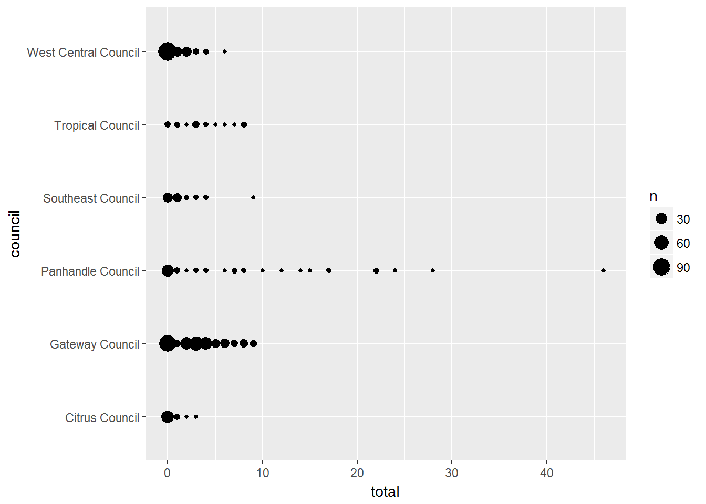

### Unexcused Absences:

<table style="width:61%;">
<colgroup>
<col width="5%" />
<col width="5%" />
<col width="5%" />
<col width="5%" />
<col width="5%" />
<col width="5%" />
<col width="5%" />
<col width="5%" />
<col width="5%" />
<col width="5%" />
<col width="5%" />
</colgroup>
<thead>
<tr class="header">
<th align="center">0</th>
<th align="center">1</th>
<th align="center">2</th>
<th align="center">3</th>
<th align="center">4</th>
<th align="center">5</th>
<th align="center">6</th>
<th align="center">7</th>
<th align="center">8</th>
<th align="center">9</th>
<th align="center">20</th>
</tr>
</thead>
<tbody>
<tr class="odd">
<td align="center">340</td>
<td align="center">54</td>
<td align="center">68</td>
<td align="center">34</td>
<td align="center">20</td>
<td align="center">12</td>
<td align="center">6</td>
<td align="center">10</td>
<td align="center">5</td>
<td align="center">3</td>
<td align="center">1</td>
</tr>
</tbody>
</table>

<table style="width:99%;">
<caption>Unexcused Absences by Council</caption>
<colgroup>
<col width="37%" />
<col width="5%" />
<col width="5%" />
<col width="5%" />
<col width="5%" />
<col width="5%" />
<col width="5%" />
<col width="5%" />
<col width="5%" />
<col width="5%" />
<col width="5%" />
<col width="5%" />
</colgroup>
<thead>
<tr class="header">
<th align="center"> </th>
<th align="center">0</th>
<th align="center">1</th>
<th align="center">2</th>
<th align="center">3</th>
<th align="center">4</th>
<th align="center">5</th>
<th align="center">6</th>
<th align="center">7</th>
<th align="center">8</th>
<th align="center">9</th>
<th align="center">20</th>
</tr>
</thead>
<tbody>
<tr class="odd">
<td align="center"><strong>Citrus Council</strong></td>
<td align="center">40</td>
<td align="center">4</td>
<td align="center">0</td>
<td align="center">1</td>
<td align="center">0</td>
<td align="center">0</td>
<td align="center">0</td>
<td align="center">0</td>
<td align="center">0</td>
<td align="center">0</td>
<td align="center">0</td>
</tr>
<tr class="even">
<td align="center"><strong>Gateway Council</strong></td>
<td align="center">112</td>
<td align="center">21</td>
<td align="center">62</td>
<td align="center">29</td>
<td align="center">18</td>
<td align="center">10</td>
<td align="center">6</td>
<td align="center">8</td>
<td align="center">4</td>
<td align="center">2</td>
<td align="center">0</td>
</tr>
<tr class="odd">
<td align="center"><strong>Panhandle Council</strong></td>
<td align="center">7</td>
<td align="center">1</td>
<td align="center">0</td>
<td align="center">0</td>
<td align="center">1</td>
<td align="center">2</td>
<td align="center">0</td>
<td align="center">2</td>
<td align="center">1</td>
<td align="center">0</td>
<td align="center">1</td>
</tr>
<tr class="even">
<td align="center"><strong>Southeast Council</strong></td>
<td align="center">21</td>
<td align="center">14</td>
<td align="center">2</td>
<td align="center">2</td>
<td align="center">0</td>
<td align="center">0</td>
<td align="center">0</td>
<td align="center">0</td>
<td align="center">0</td>
<td align="center">1</td>
<td align="center">0</td>
</tr>
<tr class="odd">
<td align="center"><strong>Tropical Council</strong></td>
<td align="center">17</td>
<td align="center">1</td>
<td align="center">1</td>
<td align="center">2</td>
<td align="center">1</td>
<td align="center">0</td>
<td align="center">0</td>
<td align="center">0</td>
<td align="center">0</td>
<td align="center">0</td>
<td align="center">0</td>
</tr>
<tr class="even">
<td align="center"><strong>West Central Council</strong></td>
<td align="center">143</td>
<td align="center">13</td>
<td align="center">3</td>
<td align="center">0</td>
<td align="center">0</td>
<td align="center">0</td>
<td align="center">0</td>
<td align="center">0</td>
<td align="center">0</td>
<td align="center">0</td>
<td align="center">0</td>
</tr>
</tbody>
</table>

### Excused Absences:

<table style="width:100%;">
<colgroup>
<col width="5%" />
<col width="5%" />
<col width="5%" />
<col width="5%" />
<col width="5%" />
<col width="5%" />
<col width="5%" />
<col width="5%" />
<col width="5%" />
<col width="6%" />
<col width="6%" />
<col width="6%" />
<col width="6%" />
<col width="6%" />
<col width="6%" />
<col width="6%" />
<col width="6%" />
</colgroup>
<thead>
<tr class="header">
<th align="center">0</th>
<th align="center">1</th>
<th align="center">2</th>
<th align="center">3</th>
<th align="center">4</th>
<th align="center">5</th>
<th align="center">6</th>
<th align="center">7</th>
<th align="center">8</th>
<th align="center">10</th>
<th align="center">14</th>
<th align="center">15</th>
<th align="center">17</th>
<th align="center">18</th>
<th align="center">20</th>
<th align="center">23</th>
<th align="center">26</th>
</tr>
</thead>
<tbody>
<tr class="odd">
<td align="center">342</td>
<td align="center">98</td>
<td align="center">62</td>
<td align="center">21</td>
<td align="center">11</td>
<td align="center">2</td>
<td align="center">1</td>
<td align="center">2</td>
<td align="center">3</td>
<td align="center">3</td>
<td align="center">1</td>
<td align="center">1</td>
<td align="center">2</td>
<td align="center">1</td>
<td align="center">1</td>
<td align="center">1</td>
<td align="center">1</td>
</tr>
</tbody>
</table>

<table>
<caption>Excused Absences by Council (continued below)</caption>
<colgroup>
<col width="34%" />
<col width="5%" />
<col width="5%" />
<col width="5%" />
<col width="5%" />
<col width="5%" />
<col width="5%" />
<col width="5%" />
<col width="5%" />
<col width="5%" />
<col width="6%" />
<col width="6%" />
<col width="6%" />
</colgroup>
<thead>
<tr class="header">
<th align="center"> </th>
<th align="center">0</th>
<th align="center">1</th>
<th align="center">2</th>
<th align="center">3</th>
<th align="center">4</th>
<th align="center">5</th>
<th align="center">6</th>
<th align="center">7</th>
<th align="center">8</th>
<th align="center">10</th>
<th align="center">14</th>
<th align="center">15</th>
</tr>
</thead>
<tbody>
<tr class="odd">
<td align="center"><strong>Citrus Council</strong></td>
<td align="center">43</td>
<td align="center">2</td>
<td align="center">0</td>
<td align="center">0</td>
<td align="center">0</td>
<td align="center">0</td>
<td align="center">0</td>
<td align="center">0</td>
<td align="center">0</td>
<td align="center">0</td>
<td align="center">0</td>
<td align="center">0</td>
</tr>
<tr class="even">
<td align="center"><strong>Gateway Council</strong></td>
<td align="center">133</td>
<td align="center">71</td>
<td align="center">47</td>
<td align="center">15</td>
<td align="center">6</td>
<td align="center">0</td>
<td align="center">0</td>
<td align="center">0</td>
<td align="center">0</td>
<td align="center">0</td>
<td align="center">0</td>
<td align="center">0</td>
</tr>
<tr class="odd">
<td align="center"><strong>Panhandle Council</strong></td>
<td align="center">2</td>
<td align="center">0</td>
<td align="center">0</td>
<td align="center">0</td>
<td align="center">1</td>
<td align="center">0</td>
<td align="center">0</td>
<td align="center">1</td>
<td align="center">0</td>
<td align="center">3</td>
<td align="center">1</td>
<td align="center">1</td>
</tr>
<tr class="even">
<td align="center"><strong>Southeast Council</strong></td>
<td align="center">36</td>
<td align="center">2</td>
<td align="center">1</td>
<td align="center">0</td>
<td align="center">1</td>
<td align="center">0</td>
<td align="center">0</td>
<td align="center">0</td>
<td align="center">0</td>
<td align="center">0</td>
<td align="center">0</td>
<td align="center">0</td>
</tr>
<tr class="odd">
<td align="center"><strong>Tropical Council</strong></td>
<td align="center">8</td>
<td align="center">3</td>
<td align="center">0</td>
<td align="center">5</td>
<td align="center">0</td>
<td align="center">1</td>
<td align="center">1</td>
<td align="center">1</td>
<td align="center">3</td>
<td align="center">0</td>
<td align="center">0</td>
<td align="center">0</td>
</tr>
<tr class="even">
<td align="center"><strong>West Central Council</strong></td>
<td align="center">120</td>
<td align="center">20</td>
<td align="center">14</td>
<td align="center">1</td>
<td align="center">3</td>
<td align="center">1</td>
<td align="center">0</td>
<td align="center">0</td>
<td align="center">0</td>
<td align="center">0</td>
<td align="center">0</td>
<td align="center">0</td>
</tr>
</tbody>
</table>

<table style="width:72%;">
<colgroup>
<col width="37%" />
<col width="6%" />
<col width="6%" />
<col width="6%" />
<col width="6%" />
<col width="6%" />
</colgroup>
<thead>
<tr class="header">
<th align="center"> </th>
<th align="center">17</th>
<th align="center">18</th>
<th align="center">20</th>
<th align="center">23</th>
<th align="center">26</th>
</tr>
</thead>
<tbody>
<tr class="odd">
<td align="center"><strong>Citrus Council</strong></td>
<td align="center">0</td>
<td align="center">0</td>
<td align="center">0</td>
<td align="center">0</td>
<td align="center">0</td>
</tr>
<tr class="even">
<td align="center"><strong>Gateway Council</strong></td>
<td align="center">0</td>
<td align="center">0</td>
<td align="center">0</td>
<td align="center">0</td>
<td align="center">0</td>
</tr>
<tr class="odd">
<td align="center"><strong>Panhandle Council</strong></td>
<td align="center">2</td>
<td align="center">1</td>
<td align="center">1</td>
<td align="center">1</td>
<td align="center">1</td>
</tr>
<tr class="even">
<td align="center"><strong>Southeast Council</strong></td>
<td align="center">0</td>
<td align="center">0</td>
<td align="center">0</td>
<td align="center">0</td>
<td align="center">0</td>
</tr>
<tr class="odd">
<td align="center"><strong>Tropical Council</strong></td>
<td align="center">0</td>
<td align="center">0</td>
<td align="center">0</td>
<td align="center">0</td>
<td align="center">0</td>
</tr>
<tr class="even">
<td align="center"><strong>West Central Council</strong></td>
<td align="center">0</td>
<td align="center">0</td>
<td align="center">0</td>
<td align="center">0</td>
<td align="center">0</td>
</tr>
</tbody>
</table>

### Attendance Analysis

Attendance is vital for academic success and data has shown that being absent 10 percent of school days excused or unexcused places students in danger of negative outcomes such as dropping out of school(“PreventingMissedOpportunityFull\_FINAL9.8.16\_2.pdf” 2017). This analysis shows that a little over 20% of the students in the program are in danger of chronic absenteeism. Students with 4 or more absences in the first quarter could be labeled at risk for chronic absenteeism.

The Get REAL! program is designed to engage at risk students and provide incentives for attendance and positive behavior. Attendance rates of students should be monitored closely to intervene as quick as possible. Last year 54% of the students improved their attendance from baseline to final grading period.

Improvement in School Behavior
==============================

*Objective: 70% of participating students will show improvement in behavior by decreasing their number of suspensions from the baseline grading period to final grading period or not having a suspension during the school year as evidenced from the student's report card/school reports.*

Baseline data indicates number of valid data entries is **553** and the percent of students who have not experienced a suspension as of Quarter 1 is **89.69%**

<table style="width:33%;">
<colgroup>
<col width="5%" />
<col width="5%" />
<col width="5%" />
<col width="5%" />
<col width="5%" />
<col width="5%" />
</colgroup>
<thead>
<tr class="header">
<th align="center">0</th>
<th align="center">1</th>
<th align="center">2</th>
<th align="center">3</th>
<th align="center">4</th>
<th align="center">5</th>
</tr>
</thead>
<tbody>
<tr class="odd">
<td align="center">496</td>
<td align="center">21</td>
<td align="center">16</td>
<td align="center">7</td>
<td align="center">6</td>
<td align="center">7</td>
</tr>
</tbody>
</table>

<table style="width:71%;">
<caption>Suspensions by Council</caption>
<colgroup>
<col width="37%" />
<col width="5%" />
<col width="5%" />
<col width="5%" />
<col width="5%" />
<col width="5%" />
<col width="5%" />
</colgroup>
<thead>
<tr class="header">
<th align="center"> </th>
<th align="center">0</th>
<th align="center">1</th>
<th align="center">2</th>
<th align="center">3</th>
<th align="center">4</th>
<th align="center">5</th>
</tr>
</thead>
<tbody>
<tr class="odd">
<td align="center"><strong>Citrus Council</strong></td>
<td align="center">45</td>
<td align="center">0</td>
<td align="center">0</td>
<td align="center">0</td>
<td align="center">0</td>
<td align="center">0</td>
</tr>
<tr class="even">
<td align="center"><strong>Gateway Council</strong></td>
<td align="center">217</td>
<td align="center">19</td>
<td align="center">16</td>
<td align="center">7</td>
<td align="center">6</td>
<td align="center">7</td>
</tr>
<tr class="odd">
<td align="center"><strong>Panhandle Council</strong></td>
<td align="center">15</td>
<td align="center">0</td>
<td align="center">0</td>
<td align="center">0</td>
<td align="center">0</td>
<td align="center">0</td>
</tr>
<tr class="even">
<td align="center"><strong>Southeast Council</strong></td>
<td align="center">40</td>
<td align="center">0</td>
<td align="center">0</td>
<td align="center">0</td>
<td align="center">0</td>
<td align="center">0</td>
</tr>
<tr class="odd">
<td align="center"><strong>Tropical Council</strong></td>
<td align="center">22</td>
<td align="center">0</td>
<td align="center">0</td>
<td align="center">0</td>
<td align="center">0</td>
<td align="center">0</td>
</tr>
<tr class="even">
<td align="center"><strong>West Central Council</strong></td>
<td align="center">157</td>
<td align="center">2</td>
<td align="center">0</td>
<td align="center">0</td>
<td align="center">0</td>
<td align="center">0</td>
</tr>
</tbody>
</table>

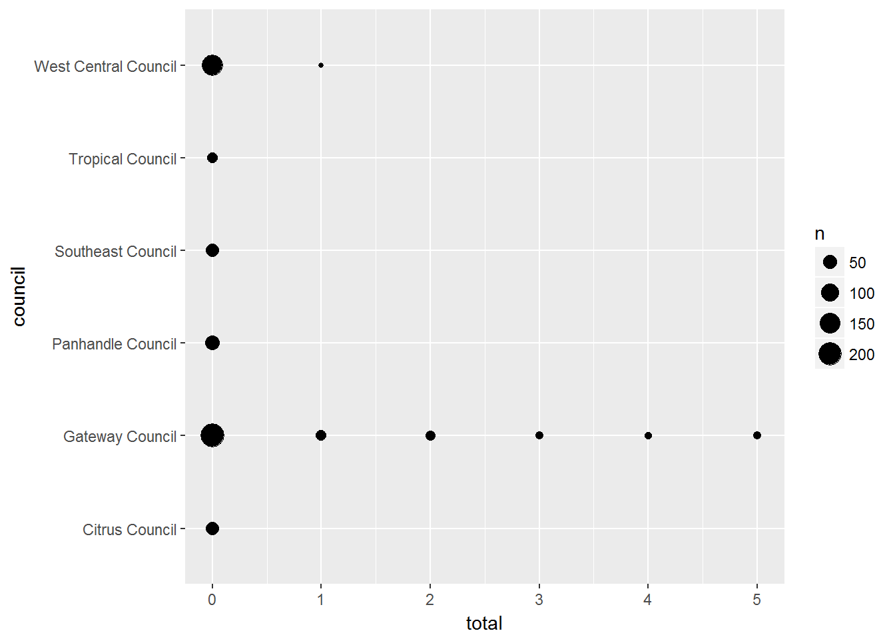

Out of Scool Suspensions
========================

<table style="width:28%;">
<colgroup>
<col width="5%" />
<col width="5%" />
<col width="5%" />
<col width="5%" />
<col width="5%" />
</colgroup>
<thead>
<tr class="header">
<th align="center">0</th>
<th align="center">1</th>
<th align="center">2</th>
<th align="center">3</th>
<th align="center">4</th>
</tr>
</thead>
<tbody>
<tr class="odd">
<td align="center">533</td>
<td align="center">6</td>
<td align="center">6</td>
<td align="center">7</td>
<td align="center">1</td>
</tr>
</tbody>
</table>

<table style="width:65%;">
<caption>Out of School Suspenions by Council</caption>
<colgroup>
<col width="37%" />
<col width="5%" />
<col width="5%" />
<col width="5%" />
<col width="5%" />
<col width="5%" />
</colgroup>
<thead>
<tr class="header">
<th align="center"> </th>
<th align="center">0</th>
<th align="center">1</th>
<th align="center">2</th>
<th align="center">3</th>
<th align="center">4</th>
</tr>
</thead>
<tbody>
<tr class="odd">
<td align="center"><strong>Citrus Council</strong></td>
<td align="center">45</td>
<td align="center">0</td>
<td align="center">0</td>
<td align="center">0</td>
<td align="center">0</td>
</tr>
<tr class="even">
<td align="center"><strong>Gateway Council</strong></td>
<td align="center">254</td>
<td align="center">4</td>
<td align="center">6</td>
<td align="center">7</td>
<td align="center">1</td>
</tr>
<tr class="odd">
<td align="center"><strong>Panhandle Council</strong></td>
<td align="center">15</td>
<td align="center">0</td>
<td align="center">0</td>
<td align="center">0</td>
<td align="center">0</td>
</tr>
<tr class="even">
<td align="center"><strong>Southeast Council</strong></td>
<td align="center">40</td>
<td align="center">0</td>
<td align="center">0</td>
<td align="center">0</td>
<td align="center">0</td>
</tr>
<tr class="odd">
<td align="center"><strong>Tropical Council</strong></td>
<td align="center">22</td>
<td align="center">0</td>
<td align="center">0</td>
<td align="center">0</td>
<td align="center">0</td>
</tr>
<tr class="even">
<td align="center"><strong>West Central Council</strong></td>
<td align="center">157</td>
<td align="center">2</td>
<td align="center">0</td>
<td align="center">0</td>
<td align="center">0</td>
</tr>
</tbody>
</table>

In School Suspensions
=====================

<table style="width:28%;">
<colgroup>
<col width="5%" />
<col width="5%" />
<col width="5%" />
<col width="5%" />
<col width="5%" />
</colgroup>
<thead>
<tr class="header">
<th align="center">0</th>
<th align="center">1</th>
<th align="center">2</th>
<th align="center">3</th>
<th align="center">4</th>
</tr>
</thead>
<tbody>
<tr class="odd">
<td align="center">502</td>
<td align="center">22</td>
<td align="center">23</td>
<td align="center">2</td>
<td align="center">4</td>
</tr>
</tbody>
</table>

<table style="width:65%;">
<caption>In School Suspenions by Council</caption>
<colgroup>
<col width="37%" />
<col width="5%" />
<col width="5%" />
<col width="5%" />
<col width="5%" />
<col width="5%" />
</colgroup>
<thead>
<tr class="header">
<th align="center"> </th>
<th align="center">0</th>
<th align="center">1</th>
<th align="center">2</th>
<th align="center">3</th>
<th align="center">4</th>
</tr>
</thead>
<tbody>
<tr class="odd">
<td align="center"><strong>Citrus Council</strong></td>
<td align="center">45</td>
<td align="center">0</td>
<td align="center">0</td>
<td align="center">0</td>
<td align="center">0</td>
</tr>
<tr class="even">
<td align="center"><strong>Gateway Council</strong></td>
<td align="center">221</td>
<td align="center">22</td>
<td align="center">23</td>
<td align="center">2</td>
<td align="center">4</td>
</tr>
<tr class="odd">
<td align="center"><strong>Panhandle Council</strong></td>
<td align="center">15</td>
<td align="center">0</td>
<td align="center">0</td>
<td align="center">0</td>
<td align="center">0</td>
</tr>
<tr class="even">
<td align="center"><strong>Southeast Council</strong></td>
<td align="center">40</td>
<td align="center">0</td>
<td align="center">0</td>
<td align="center">0</td>
<td align="center">0</td>
</tr>
<tr class="odd">
<td align="center"><strong>Tropical Council</strong></td>
<td align="center">22</td>
<td align="center">0</td>
<td align="center">0</td>
<td align="center">0</td>
<td align="center">0</td>
</tr>
<tr class="even">
<td align="center"><strong>West Central Council</strong></td>
<td align="center">159</td>
<td align="center">0</td>
<td align="center">0</td>
<td align="center">0</td>
<td align="center">0</td>
</tr>
</tbody>
</table>

Expelled
========

<table style="width:6%;">
<colgroup>
<col width="5%" />
</colgroup>
<thead>
<tr class="header">
<th align="center">No</th>
</tr>
</thead>
<tbody>
<tr class="odd">
<td align="center">553</td>
</tr>
</tbody>
</table>

“PreventingMissedOpportunityFull\_FINAL9.8.16\_2.pdf.” 2017. Accessed January 1. <http://www.attendanceworks.org/wordpress/wp-content/uploads/2016/08/PreventingMissedOpportunityFull_FINAL9.8.16_2.pdf>.
