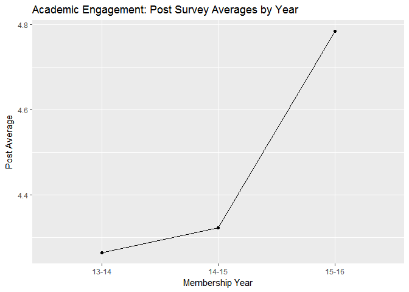
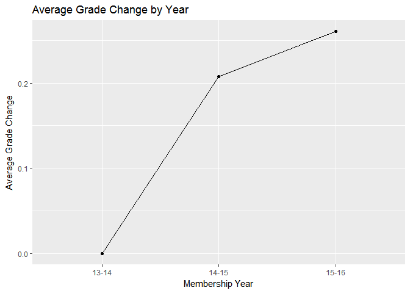

Get REAL! Trend Report
================
Kevin Gilds, MPA
April 23, 2017

Executive Summary
=================

The goal of this report is to provide an internal report about data trends in the Get REAL! program and to identify strengths and areas for improvement.

The Get REAL! program is meeting the objectives established for itself. Student surveys and academic data from the Get REAL! program was pulled from the last 3 year membership years and analyzed for trend data. Attendance data and behavior data were only analyzed for the last two membership years.

This report is broken into a life skills section and academic data section. The overall trend is that students in the program are demonstrating improvement in life skills and academic data. The report shows increased post survey averages along with increased change in grades over the past three years.The most impressive statistic is that **75%** of students who started with a failing grade finish with a C or higher in their Language Arts courses.

Life Skills
-----------

### Methodology

The questions and the scoring methodology of the girl survey were developed and tested by the Girl Scout Research Institute. Girls answer multiple questions to obtain an outcome score for each life skill domain. Responses to survey questions are assigned numbers/points and outcome scores are calculated by averaging responses to survey questions for each category. The points for each outcome set are averaged to obtain an outcome score. Outcome cutpoints are determined by the number of questions in the outcome set and response options. Outcomes scores range from 0-6. Below is a breakdown of the cut-points by the outcomes measured. Outcome cut-points are used to determine high achievement. Below is a breakdown of the cutpoints by the outcomes measured.

| outcome               |  criteria|
|:----------------------|---------:|
| Healthy Relationships |      4.45|
| Academic Mastery      |      4.80|
| Academic Engagement   |      4.50|

*Objective --70% of participating girls will demonstrate an increased understanding of pertinent life skills as demonstrated by a pre and post assessment*

The student-survey is administered measures the following life skills, healthy relationships, academic engagement, and academic mastery.

• Healthy Relationships--Measures relationship skills with peers and adults.

• Academic Engagement--Measures specific behaviors related to school success.

• Academic Mastery--Measures attitude toward education.

### Life Skills Results Summary

Over a three year period 970 students had matched pre and post surveys. There are 116 students who were matched for multiple years. The data shows that the match students outperformed their peers in the realm of Academic Mastery but not in Healthy Relationships or Academic Engagement. Post survey outcome scores are trending up from the baseline year.

To have a successful outcome students either need to achieve a domain at a high level on the post survey or increase from pre to post if they are not achieving at a high level.

The results over two years:

-   79% Healthy Relationships
-   73% Academic Engagement
-   81% Academic Mastery

### Data Entry Status for Life Skills

|                      |  13-14|  14-15|  15-16|  Sum|
|----------------------|------:|------:|------:|----:|
| Citrus Council       |      0|     25|      0|   25|
| Gateway Council      |    110|    216|    204|  530|
| Gulfcoast Council    |     10|      0|      0|   10|
| Panhandle Council    |      0|     23|      8|   31|
| Southeast Council    |     66|     41|     38|  145|
| Tropical Council     |      0|      1|      6|    7|
| West Central Council |     53|     95|     74|  222|
| Sum                  |    239|    401|    330|  970|

Healthy Relationships
=====================

Post Survey Success
-------------------

| Success |    n|  percent|
|:--------|----:|--------:|
| FALSE   |  203|   20.93%|
| TRUE    |  767|   79.07%|

### Achievement by Council

| council              | Success |    n|  percent|
|:---------------------|:--------|----:|--------:|
| Citrus Council       | TRUE    |   18|   72.00%|
| Gateway Council      | TRUE    |  431|   81.32%|
| Gulfcoast Council    | TRUE    |    8|   80.00%|
| Panhandle Council    | TRUE    |   22|   70.97%|
| Southeast Council    | TRUE    |  104|   71.72%|
| Tropical Council     | TRUE    |    7|  100.00%|
| West Central Council | TRUE    |  177|   79.73%|

### Achievement by Matched Status

| Match | Success |    n|  percent|
|:------|:--------|----:|--------:|
| No    | FALSE   |  179|   20.96%|
| No    | TRUE    |  675|   79.04%|
| Yes   | FALSE   |   24|   20.69%|
| Yes   | TRUE    |   92|   79.31%|

Average Difference between Pre and Post Surveys
-----------------------------------------------

The mean difference between pre and post survey is *0.2078*.

| Match |       mean|
|:------|----------:|
| No    |  0.2253513|
| Yes   |  0.0782328|

### Average Difference by Year

<table style="width:29%;">
<colgroup>
<col width="13%" />
<col width="15%" />
</colgroup>
<thead>
<tr class="header">
<th align="center">Year_Id</th>
<th align="center">hr.diff</th>
</tr>
</thead>
<tbody>
<tr class="odd">
<td align="center">13-14</td>
<td align="center">-0.01182008</td>
</tr>
<tr class="even">
<td align="center">14-15</td>
<td align="center">0.17680798</td>
</tr>
<tr class="odd">
<td align="center">15-16</td>
<td align="center">0.40439394</td>
</tr>
</tbody>
</table>

### Average Difference between Pre and Post by Council

<table style="width:44%;">
<colgroup>
<col width="29%" />
<col width="15%" />
</colgroup>
<thead>
<tr class="header">
<th align="center">council</th>
<th align="center">hr.diff</th>
</tr>
</thead>
<tbody>
<tr class="odd">
<td align="center">Citrus Council</td>
<td align="center">0.13400000</td>
</tr>
<tr class="even">
<td align="center">Gateway Council</td>
<td align="center">0.37429245</td>
</tr>
<tr class="odd">
<td align="center">Gulfcoast Council</td>
<td align="center">0.49500000</td>
</tr>
<tr class="even">
<td align="center">Panhandle Council</td>
<td align="center">-0.33548387</td>
</tr>
<tr class="odd">
<td align="center">Southeast Council</td>
<td align="center">-0.11017241</td>
</tr>
<tr class="even">
<td align="center">Tropical Council</td>
<td align="center">0.72142857</td>
</tr>
<tr class="odd">
<td align="center">West Central Council</td>
<td align="center">0.07286036</td>
</tr>
</tbody>
</table>

Post Survey Average Score
-------------------------

<table style="width:28%;">
<colgroup>
<col width="13%" />
<col width="13%" />
</colgroup>
<thead>
<tr class="header">
<th align="center">Year_Id</th>
<th align="center">Post</th>
</tr>
</thead>
<tbody>
<tr class="odd">
<td align="center">13-14</td>
<td align="center">4.597071</td>
</tr>
<tr class="even">
<td align="center">14-15</td>
<td align="center">4.627681</td>
</tr>
<tr class="odd">
<td align="center">15-16</td>
<td align="center">4.935152</td>
</tr>
</tbody>
</table>

| Match |      Post|
|:------|---------:|
| No    |  4.736680|
| Yes   |  4.636853|

Academic Engagement
===================

Post Survey Achievment
----------------------

| Success |    n|  percent|
|:--------|----:|--------:|
| FALSE   |  257|   26.49%|
| TRUE    |  713|   73.51%|

### Achievement by Council

| council              | Success |    n|  percent|
|:---------------------|:--------|----:|--------:|
| Citrus Council       | TRUE    |   11|   44.00%|
| Gateway Council      | TRUE    |  440|   83.02%|
| Gulfcoast Council    | TRUE    |    9|   90.00%|
| Panhandle Council    | TRUE    |   17|   54.84%|
| Southeast Council    | TRUE    |   88|   60.69%|
| Tropical Council     | TRUE    |    6|   85.71%|
| West Central Council | TRUE    |  142|   63.96%|

### Achievement by Matched Status

| Match | Success |    n|  percent|
|:------|:--------|----:|--------:|
| No    | FALSE   |  221|   25.88%|
| No    | TRUE    |  633|   74.12%|
| Yes   | FALSE   |   36|   31.03%|
| Yes   | TRUE    |   80|   68.97%|

Average Difference between Pre and Post Surveys
-----------------------------------------------

The mean difference between pre and post survey is *0.3534*.

| Match |       mean|
|:------|----------:|
| No    |  0.3565574|
| Yes   |  0.3297414|

### Average Difference by Year

<table style="width:28%;">
<colgroup>
<col width="13%" />
<col width="13%" />
</colgroup>
<thead>
<tr class="header">
<th align="center">Year_Id</th>
<th align="center">ae.diff</th>
</tr>
</thead>
<tbody>
<tr class="odd">
<td align="center">13-14</td>
<td align="center">0.06589958</td>
</tr>
<tr class="even">
<td align="center">14-15</td>
<td align="center">0.48908978</td>
</tr>
<tr class="odd">
<td align="center">15-16</td>
<td align="center">0.39659091</td>
</tr>
</tbody>
</table>

### Average Difference between Pre and Post by Council

<table style="width:44%;">
<colgroup>
<col width="29%" />
<col width="15%" />
</colgroup>
<thead>
<tr class="header">
<th align="center">council</th>
<th align="center">ae.diff</th>
</tr>
</thead>
<tbody>
<tr class="odd">
<td align="center">Citrus Council</td>
<td align="center">-0.33000000</td>
</tr>
<tr class="even">
<td align="center">Gateway Council</td>
<td align="center">0.69622642</td>
</tr>
<tr class="odd">
<td align="center">Gulfcoast Council</td>
<td align="center">0.33750000</td>
</tr>
<tr class="even">
<td align="center">Panhandle Council</td>
<td align="center">-0.31451613</td>
</tr>
<tr class="odd">
<td align="center">Southeast Council</td>
<td align="center">-0.13448276</td>
</tr>
<tr class="even">
<td align="center">Tropical Council</td>
<td align="center">0.26785714</td>
</tr>
<tr class="odd">
<td align="center">West Central Council</td>
<td align="center">0.02702703</td>
</tr>
</tbody>
</table>

Post Survey Average Score
-------------------------

| Match |      Post|
|:------|---------:|
| No    |  4.490779|
| Yes   |  4.280172|

| Year\_Id |      Post|
|:---------|---------:|
| 13-14    |  4.264644|
| 14-15    |  4.323254|
| 15-16    |  4.784091|

### Post Survey Average Score by Council

| council              |      Post|
|:---------------------|---------:|
| Citrus Council       |  3.705000|
| Gateway Council      |  4.789387|
| Gulfcoast Council    |  4.575000|
| Panhandle Council    |  3.786290|
| Southeast Council    |  4.174138|
| Tropical Council     |  3.964286|
| West Central Council |  4.074324|

Academic Mastery
================

Post Survey Achievment
----------------------

| Success |    n|  percent|
|:--------|----:|--------:|
| FALSE   |  180|   18.56%|
| TRUE    |  790|   81.44%|

### Achievement by Council

| council              | Success |    n|  percent|
|:---------------------|:--------|----:|--------:|
| Citrus Council       | TRUE    |   21|   84.00%|
| Gateway Council      | TRUE    |  383|   72.26%|
| Gulfcoast Council    | TRUE    |   10|  100.00%|
| Panhandle Council    | TRUE    |   26|   83.87%|
| Southeast Council    | TRUE    |  138|   95.17%|
| Tropical Council     | TRUE    |    7|  100.00%|
| West Central Council | TRUE    |  205|   92.34%|

### Achievment by Matched Status

| Match | Success |    n|  Percent|
|:------|:--------|----:|--------:|
| No    | FALSE   |  164|   19.20%|
| No    | TRUE    |  690|   80.80%|
| Yes   | FALSE   |   16|   13.79%|
| Yes   | TRUE    |  100|   86.21%|

Average Difference between Pre and Post Surveys
-----------------------------------------------

The mean difference between pre and post survey is *-0.04849*.

| Match |        mean|
|:------|-----------:|
| No    |  -0.0480562|
| Yes   |  -0.0517241|

<table style="width:28%;">
<colgroup>
<col width="13%" />
<col width="13%" />
</colgroup>
<thead>
<tr class="header">
<th align="center">Year_Id</th>
<th align="center">am.diff</th>
</tr>
</thead>
<tbody>
<tr class="odd">
<td align="center">13-14</td>
<td align="center">-0.2410042</td>
</tr>
<tr class="even">
<td align="center">14-15</td>
<td align="center">-0.1526185</td>
</tr>
<tr class="odd">
<td align="center">15-16</td>
<td align="center">0.2174545</td>
</tr>
</tbody>
</table>

### Average Difference between Pre and Post by Council

<table style="width:44%;">
<colgroup>
<col width="29%" />
<col width="15%" />
</colgroup>
<thead>
<tr class="header">
<th align="center">council</th>
<th align="center">am.diff</th>
</tr>
</thead>
<tbody>
<tr class="odd">
<td align="center">Citrus Council</td>
<td align="center">0.03840000</td>
</tr>
<tr class="even">
<td align="center">Gateway Council</td>
<td align="center">-0.06022642</td>
</tr>
<tr class="odd">
<td align="center">Gulfcoast Council</td>
<td align="center">0.04800000</td>
</tr>
<tr class="even">
<td align="center">Panhandle Council</td>
<td align="center">-0.19354839</td>
</tr>
<tr class="odd">
<td align="center">Southeast Council</td>
<td align="center">0.06455172</td>
</tr>
<tr class="even">
<td align="center">Tropical Council</td>
<td align="center">0.24000000</td>
</tr>
<tr class="odd">
<td align="center">West Central Council</td>
<td align="center">-0.09729730</td>
</tr>
</tbody>
</table>

Post Survey Average Scores
--------------------------

| Match |      Post|
|:------|---------:|
| No    |  5.090304|
| Yes   |  5.191034|

<table style="width:28%;">
<colgroup>
<col width="13%" />
<col width="13%" />
</colgroup>
<thead>
<tr class="header">
<th align="center">Year_Id</th>
<th align="center">Post</th>
</tr>
</thead>
<tbody>
<tr class="odd">
<td align="center">13-14</td>
<td align="center">5.164519</td>
</tr>
<tr class="even">
<td align="center">14-15</td>
<td align="center">4.931072</td>
</tr>
<tr class="odd">
<td align="center">15-16</td>
<td align="center">5.265455</td>
</tr>
</tbody>
</table>

### Post Survey Average Score by Council

| council              |      Post|
|:---------------------|---------:|
| Citrus Council       |  5.241600|
| Gateway Council      |  4.862491|
| Gulfcoast Council    |  5.712000|
| Panhandle Council    |  5.225807|
| Southeast Council    |  5.594483|
| Tropical Council     |  4.971429|
| West Central Council |  5.297297|

### Academic Data Results Summary

The Get REAL! program is meeting the academic objectives that it has established for itself. Students who were matched for multiple years are out performing their peers who were only matched once in the academic realms.

**Reading Improvement:**

*50% of participating students will improve their reading skills as demonstrated by their Language Arts grade increasing or maintaining a "C" grade from the baseline grading period to the final grading period as evidenced by report cards/school reports.*

**Results:76% of the students are achieving this objective**.

The caveat is that 61% of these students are maintaining their grade rather then increasing their grade. In addition to achieving the objective, there has been on average an increase in the difference between baseline and final grades for both Language Arts and Reading grades.

**Improved Attendance:**

*60% of participating students will either maintain or improve their attendance rate.*

**Results: 61% of students are achieving this outcome**.

This is a challenging outcome because a student may have zero absences at baseline and 1 absences in the final. This would be a negative outcome and the objective is not capturing the over arching goal of the program.

This objective may benefit from a more nuanced wording to capture the impact of the Get REAL program! For instance, looking more closely at the outcome of students with 4 or absences at baseline.

**Improvement In School Behavior**

*70% of participating students will show improvement in behavior by decreasing their number of suspensions from the baseliine to final.*

**Results: 92% of students have demonstrated a successful outcome.**

Nearly 83% of students in the program never receive a suspension. However, there is an increased average difference between baseline and final. This means that there is a segment of students about 8% that continue to receive suspensions from baseline to final grading period.

Language Arts Grade Data
========================

The number of students that were matched from the past 3 Membership Years is **1763**

The percent of students with a successful outcome is **76.23%**

-   The number of students who increased their grade or maintained at least a C grade is **1344**

    -   The number of students with a final grade of C and increased their grade is **524**

    -   The number of students who maintained at least a C grade is **820**

The percent of students who went from failing to passing is **75.77%**

-   The number of students who started with a failing grade is **194**

-   The number of students who increased grade from failing to passing **147**

### Achievement by Council

| council              | Success |    n|  percent|
|:---------------------|:--------|----:|--------:|
| Citrus Council       | TRUE    |   70|   62.50%|
| Gateway Council      | TRUE    |  553|   81.93%|
| Gulfcoast Council    | TRUE    |   22|   48.89%|
| Panhandle Council    | TRUE    |  208|   69.57%|
| Southeast Council    | TRUE    |  311|   82.06%|
| Tropical Council     | TRUE    |   10|   66.67%|
| West Central Council | TRUE    |  170|   71.43%|

| Match | Success |     n|  percent|
|:------|:--------|-----:|--------:|
| No    | TRUE    |  1141|   75.76%|
| Yes   | TRUE    |   203|   78.99%|

<table style="width:33%;">
<colgroup>
<col width="13%" />
<col width="19%" />
</colgroup>
<thead>
<tr class="header">
<th align="center">Year_Id</th>
<th align="center">Grade_Change</th>
</tr>
</thead>
<tbody>
<tr class="odd">
<td align="center">13-14</td>
<td align="center">-0.02154399</td>
</tr>
<tr class="even">
<td align="center">14-15</td>
<td align="center">0.12423780</td>
</tr>
<tr class="odd">
<td align="center">15-16</td>
<td align="center">0.26909091</td>
</tr>
</tbody>
</table>

<table style="width:62%;">
<colgroup>
<col width="29%" />
<col width="13%" />
<col width="19%" />
</colgroup>
<thead>
<tr class="header">
<th align="center">council</th>
<th align="center">Year_Id</th>
<th align="center">Grade_Change</th>
</tr>
</thead>
<tbody>
<tr class="odd">
<td align="center">Citrus Council</td>
<td align="center">14-15</td>
<td align="center">-0.089743590</td>
</tr>
<tr class="even">
<td align="center">Citrus Council</td>
<td align="center">15-16</td>
<td align="center">-0.029411765</td>
</tr>
<tr class="odd">
<td align="center">Gateway Council</td>
<td align="center">13-14</td>
<td align="center">0.004048583</td>
</tr>
<tr class="even">
<td align="center">Gateway Council</td>
<td align="center">14-15</td>
<td align="center">0.312500000</td>
</tr>
<tr class="odd">
<td align="center">Gateway Council</td>
<td align="center">15-16</td>
<td align="center">0.597014925</td>
</tr>
<tr class="even">
<td align="center">Gulfcoast Council</td>
<td align="center">13-14</td>
<td align="center">-0.444444444</td>
</tr>
<tr class="odd">
<td align="center">Panhandle Council</td>
<td align="center">13-14</td>
<td align="center">-0.306451613</td>
</tr>
<tr class="even">
<td align="center">Panhandle Council</td>
<td align="center">14-15</td>
<td align="center">0.088607595</td>
</tr>
<tr class="odd">
<td align="center">Southeast Council</td>
<td align="center">13-14</td>
<td align="center">0.130434783</td>
</tr>
<tr class="even">
<td align="center">Southeast Council</td>
<td align="center">14-15</td>
<td align="center">0.092920354</td>
</tr>
<tr class="odd">
<td align="center">Southeast Council</td>
<td align="center">15-16</td>
<td align="center">0.095238095</td>
</tr>
<tr class="even">
<td align="center">Tropical Council</td>
<td align="center">14-15</td>
<td align="center">0.214285714</td>
</tr>
<tr class="odd">
<td align="center">Tropical Council</td>
<td align="center">15-16</td>
<td align="center">-0.125000000</td>
</tr>
<tr class="even">
<td align="center">West Central Council</td>
<td align="center">13-14</td>
<td align="center">0.119047619</td>
</tr>
<tr class="odd">
<td align="center">West Central Council</td>
<td align="center">14-15</td>
<td align="center">0.090163934</td>
</tr>
<tr class="even">
<td align="center">West Central Council</td>
<td align="center">15-16</td>
<td align="center">-0.148148148</td>
</tr>
</tbody>
</table>

Reading Grade Data
==================

The number of students that were matched from the past 3 Membership Years is **798**

The percent of students with a successful outcome is **75.69%**

-   The number of students who increased their grade or maintained at least a C grade is **604**

    -   The number of students with a final grade of C and increased their grade is **274**

    -   The number of students who maintained at least a C grade is **330**

The percent of students who went from failing to passing is **74.16%**

-   The number of students who started with a failing grade **89**

-   The number of students who increased grade from failing to passing **66**

### Achievement by Council

| council              | Success |    n|  percent|
|:---------------------|:--------|----:|--------:|
| Citrus Council       | TRUE    |   27|   52.94%|
| Gateway Council      | TRUE    |  259|   83.01%|
| Gulfcoast Council    | TRUE    |   14|   66.67%|
| Panhandle Council    | TRUE    |   24|   54.55%|
| Southeast Council    | TRUE    |  104|   71.23%|
| Tropical Council     | TRUE    |    6|   85.71%|
| West Central Council | TRUE    |  170|   78.34%|

| Match | Success |    n|  percent|
|:------|:--------|----:|--------:|
| No    | TRUE    |  552|   75.62%|
| Yes   | TRUE    |   52|   76.47%|

Grade Changes from baseline to final
====================================

### Grade change by Matched Status

| Match |  Grade\_Change|
|:------|--------------:|
| No    |      0.1390411|
| Yes   |      0.5441176|

### Grade Change by Year

<table style="width:33%;">
<colgroup>
<col width="13%" />
<col width="19%" />
</colgroup>
<thead>
<tr class="header">
<th align="center">Year_Id</th>
<th align="center">Grade_Change</th>
</tr>
</thead>
<tbody>
<tr class="odd">
<td align="center">13-14</td>
<td align="center">0.0000000</td>
</tr>
<tr class="even">
<td align="center">14-15</td>
<td align="center">0.2079365</td>
</tr>
<tr class="odd">
<td align="center">15-16</td>
<td align="center">0.2607143</td>
</tr>
</tbody>
</table>

<table style="width:62%;">
<colgroup>
<col width="29%" />
<col width="13%" />
<col width="19%" />
</colgroup>
<thead>
<tr class="header">
<th align="center">council</th>
<th align="center">Year_Id</th>
<th align="center">Grade_Change</th>
</tr>
</thead>
<tbody>
<tr class="odd">
<td align="center">Citrus Council</td>
<td align="center">14-15</td>
<td align="center">-0.67105263</td>
</tr>
<tr class="even">
<td align="center">Citrus Council</td>
<td align="center">15-16</td>
<td align="center">0.07692308</td>
</tr>
<tr class="odd">
<td align="center">Gateway Council</td>
<td align="center">13-14</td>
<td align="center">0.21195652</td>
</tr>
<tr class="even">
<td align="center">Gateway Council</td>
<td align="center">14-15</td>
<td align="center">0.44690265</td>
</tr>
<tr class="odd">
<td align="center">Gateway Council</td>
<td align="center">15-16</td>
<td align="center">0.42056075</td>
</tr>
<tr class="even">
<td align="center">Gulfcoast Council</td>
<td align="center">13-14</td>
<td align="center">-0.14285714</td>
</tr>
<tr class="odd">
<td align="center">Panhandle Council</td>
<td align="center">13-14</td>
<td align="center">-0.89285714</td>
</tr>
<tr class="even">
<td align="center">Panhandle Council</td>
<td align="center">14-15</td>
<td align="center">0.75000000</td>
</tr>
<tr class="odd">
<td align="center">Southeast Council</td>
<td align="center">13-14</td>
<td align="center">-0.04545455</td>
</tr>
<tr class="even">
<td align="center">Southeast Council</td>
<td align="center">14-15</td>
<td align="center">0.00000000</td>
</tr>
<tr class="odd">
<td align="center">Southeast Council</td>
<td align="center">15-16</td>
<td align="center">0.15625000</td>
</tr>
<tr class="even">
<td align="center">Tropical Council</td>
<td align="center">14-15</td>
<td align="center">0.25000000</td>
</tr>
<tr class="odd">
<td align="center">Tropical Council</td>
<td align="center">15-16</td>
<td align="center">0.00000000</td>
</tr>
<tr class="even">
<td align="center">West Central Council</td>
<td align="center">13-14</td>
<td align="center">0.23750000</td>
</tr>
<tr class="odd">
<td align="center">West Central Council</td>
<td align="center">14-15</td>
<td align="center">0.32738095</td>
</tr>
<tr class="even">
<td align="center">West Central Council</td>
<td align="center">15-16</td>
<td align="center">0.18279570</td>
</tr>
</tbody>
</table>

Attendance Data
===============

The number of students in the dataset are **1245** and the number of students that could be matched across two years is **128**.The percent of students with a succesful outcome is **61.69%**. A successful outcome means not missing a day of school and the student decreasing their number of absences from baseline grading period to the final grading period.

| Success |    n|  percent|
|:--------|----:|--------:|
| FALSE   |  477|   38.31%|
| TRUE    |  768|   61.69%|

| Match | Success |    n|  percent|
|:------|:--------|----:|--------:|
| No    | TRUE    |  672|   60.16%|
| Yes   | TRUE    |   96|   75.00%|

### Achievment by Council

| Council              | Success |    n|  percent|
|:---------------------|:--------|----:|--------:|
| Citrus Council       | TRUE    |   73|   64.60%|
| Gateway Council      | TRUE    |  174|   46.15%|
| Panhandle Council    | TRUE    |  157|   61.57%|
| Southeast Council    | TRUE    |  143|   65.60%|
| Tropical Council     | TRUE    |    9|   69.23%|
| West Central Council | TRUE    |  212|   78.81%|

### Decrease in Absences

### Average Decrease for students who had a chance to improve attendance

Avg\_Change
-----------

-0.1867816

| Match |  Avg\_Change|
|:------|------------:|
| No    |   -0.2228916|
| Yes   |    0.5625000|

| Year\_Id |  Avg\_Change|
|:---------|------------:|
| 14-15    |   -2.1095306|
| 15-16    |    0.9317343|

Behavior Data (Suspensions)
===========================

Matching attendance data set from the past two membership years. The number of students in the dataset is 1304 and the number of matched students across the two years is 144.

<table style="width:67%;">
<colgroup>
<col width="37%" />
<col width="11%" />
<col width="11%" />
<col width="6%" />
</colgroup>
<thead>
<tr class="header">
<th align="center"> </th>
<th align="center">14-15</th>
<th align="center">15-16</th>
<th align="center">Sum</th>
</tr>
</thead>
<tbody>
<tr class="odd">
<td align="center"><strong>Citrus Council</strong></td>
<td align="center">78</td>
<td align="center">35</td>
<td align="center">113</td>
</tr>
<tr class="even">
<td align="center"><strong>Gateway Council</strong></td>
<td align="center">169</td>
<td align="center">266</td>
<td align="center">435</td>
</tr>
<tr class="odd">
<td align="center"><strong>Panhandle Council</strong></td>
<td align="center">255</td>
<td align="center">0</td>
<td align="center">255</td>
</tr>
<tr class="even">
<td align="center"><strong>Southeast Council</strong></td>
<td align="center">117</td>
<td align="center">102</td>
<td align="center">219</td>
</tr>
<tr class="odd">
<td align="center"><strong>Tropical Council</strong></td>
<td align="center">8</td>
<td align="center">4</td>
<td align="center">12</td>
</tr>
<tr class="even">
<td align="center"><strong>West Central Council</strong></td>
<td align="center">135</td>
<td align="center">135</td>
<td align="center">270</td>
</tr>
<tr class="odd">
<td align="center"><strong>Sum</strong></td>
<td align="center">762</td>
<td align="center">542</td>
<td align="center">1304</td>
</tr>
</tbody>
</table>

Successful Outcome
==================

### By Council

| council              | Success |    n|  percent|
|:---------------------|:--------|----:|--------:|
| Citrus Council       | TRUE    |  113|  100.00%|
| Gateway Council      | TRUE    |  429|   98.62%|
| Panhandle Council    | TRUE    |  206|   80.78%|
| Southeast Council    | TRUE    |  182|   83.11%|
| Tropical Council     | TRUE    |   12|  100.00%|
| West Central Council | TRUE    |  266|   98.52%|

### By Match

| Match | Success |     n|  percent|
|:------|:--------|-----:|--------:|
| No    | TRUE    |  1072|   92.41%|
| Yes   | TRUE    |   136|   94.44%|

Average Difference by Year
==========================

| Year\_Id |  avg\_diff|
|:---------|----------:|
| 14-15    |  14.416667|
| 15-16    |   1.333333|

| council              | Year\_Id |  avg\_diff|
|:---------------------|:---------|----------:|
| Gateway Council      | 15-16    |  -0.500000|
| Panhandle Council    | 14-15    |  18.400000|
| Southeast Council    | 14-15    |  -5.500000|
| Southeast Council    | 15-16    |   2.666667|
| West Central Council | 15-16    |   1.000000|

| Match |  avg\_diff|
|:------|----------:|
| No    |         11|
| Yes   |         -6|

Plots
=====

Strengths-Challenges-Recommendations
====================================

### Strengths

The Get REAL! program is meeting the program objectives. The objectives set out are realistic and not too easy to achieve. The life skills surveys align with the objectives of the program. The survey data tell a story of students that desire to do well in school but may not have all the social and academic tools to succeed.

### Challenges

Data entry on a timely basis and duplicate entry has been a challenge. Matching 970 students over three years is a disappointing given the enrollment numbers over the past three years. A primary driver for moving the administration of the surveys to the spring is to facilitate a higher completion rate and to have data entered by July.

### Recommendations

-   **Emphasize and encourage getting data entry into Qualtrics by June 30, 2017.**

There needs to be a cutoff in order to complete the final report. Writer can extend the data entry deadline but does not wish to extend beyond July 5.

-   **Explore updating the Attendance Objective to emphasize more impactful results.**

Currently the objective is missing the big picture of improved attendance rate. For instance students with zero absences at baseline and one at final is not considered a success. The writer will look at the impact of students with 4 or more absences. Four or more absences in a quarter places a student at risk for chronic absenteeism.
