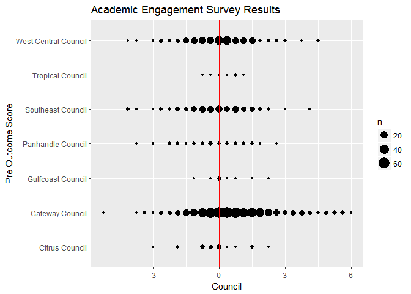

academic engagement history
================
Kevin Gilds, MPA
2017-05-05

Academic Engagement
===================

Post Survey Achievment
----------------------

| Success |    n|  percent|
|:--------|----:|--------:|
| FALSE   |  257|   26.49%|
| TRUE    |  713|   73.51%|

### Achievement by Council

| council              | Success |    n|  percent|
|:---------------------|:--------|----:|--------:|
| Citrus Council       | TRUE    |   11|   44.00%|
| Gateway Council      | TRUE    |  440|   83.02%|
| Gulfcoast Council    | TRUE    |    9|   90.00%|
| Panhandle Council    | TRUE    |   17|   54.84%|
| Southeast Council    | TRUE    |   88|   60.69%|
| Tropical Council     | TRUE    |    6|   85.71%|
| West Central Council | TRUE    |  142|   63.96%|

### Achievement by Matched Status

| Match | Success |    n|  percent|
|:------|:--------|----:|--------:|
| No    | FALSE   |  221|   25.88%|
| No    | TRUE    |  633|   74.12%|
| Yes   | FALSE   |   36|   31.03%|
| Yes   | TRUE    |   80|   68.97%|

Average Difference between Pre and Post Surveys
-----------------------------------------------

The mean difference between pre and post survey is *0.3534*.

| Match |       mean|
|:------|----------:|
| No    |  0.3565574|
| Yes   |  0.3297414|

### Average Difference by Year

<table style="width:28%;">
<colgroup>
<col width="13%" />
<col width="13%" />
</colgroup>
<thead>
<tr class="header">
<th align="center">Year_Id</th>
<th align="center">ae.diff</th>
</tr>
</thead>
<tbody>
<tr class="odd">
<td align="center">13-14</td>
<td align="center">0.06589958</td>
</tr>
<tr class="even">
<td align="center">14-15</td>
<td align="center">0.48908978</td>
</tr>
<tr class="odd">
<td align="center">15-16</td>
<td align="center">0.39659091</td>
</tr>
</tbody>
</table>

### Average Difference between Pre and Post by Council

<table style="width:44%;">
<colgroup>
<col width="29%" />
<col width="15%" />
</colgroup>
<thead>
<tr class="header">
<th align="center">council</th>
<th align="center">ae.diff</th>
</tr>
</thead>
<tbody>
<tr class="odd">
<td align="center">Citrus Council</td>
<td align="center">-0.33000000</td>
</tr>
<tr class="even">
<td align="center">Gateway Council</td>
<td align="center">0.69622642</td>
</tr>
<tr class="odd">
<td align="center">Gulfcoast Council</td>
<td align="center">0.33750000</td>
</tr>
<tr class="even">
<td align="center">Panhandle Council</td>
<td align="center">-0.31451613</td>
</tr>
<tr class="odd">
<td align="center">Southeast Council</td>
<td align="center">-0.13448276</td>
</tr>
<tr class="even">
<td align="center">Tropical Council</td>
<td align="center">0.26785714</td>
</tr>
<tr class="odd">
<td align="center">West Central Council</td>
<td align="center">0.02702703</td>
</tr>
</tbody>
</table>

Post Survey Average Score
-------------------------

| Match |      Post|
|:------|---------:|
| No    |  4.490779|
| Yes   |  4.280172|

| Year\_Id |      Post|
|:---------|---------:|
| 13-14    |  4.264644|
| 14-15    |  4.323254|
| 15-16    |  4.784091|

### Post Survey Average Score by Council

| council              |      Post|
|:---------------------|---------:|
| Citrus Council       |  3.705000|
| Gateway Council      |  4.789387|
| Gulfcoast Council    |  4.575000|
| Panhandle Council    |  3.786290|
| Southeast Council    |  4.174138|
| Tropical Council     |  3.964286|
| West Central Council |  4.074324|

    ## [1] TRUE
