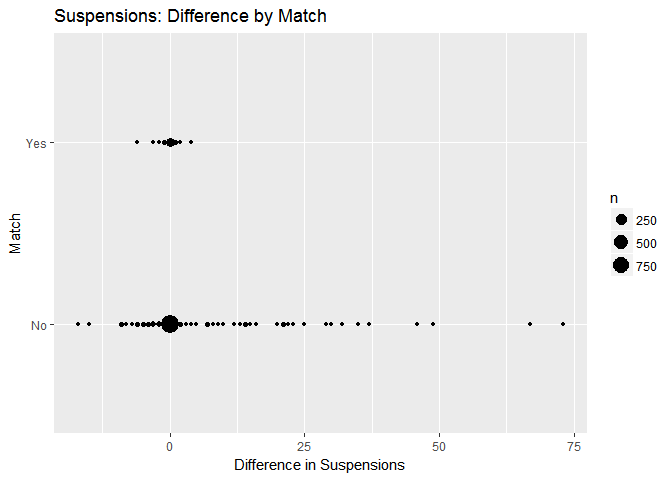
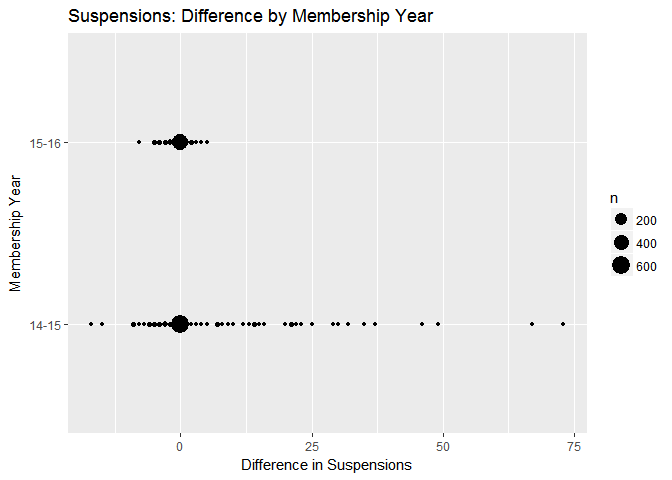

Behavior History
================
Kevin Gilds, MPA
February 18, 2017

Introduction
============

Matching attendance data set from the past two membership years. The number of students in the dataset is 1304 and the number of matched students acorss the two years is 144.

<table style="width:67%;">
<colgroup>
<col width="37%" />
<col width="11%" />
<col width="11%" />
<col width="6%" />
</colgroup>
<thead>
<tr class="header">
<th align="center"> </th>
<th align="center">14-15</th>
<th align="center">15-16</th>
<th align="center">Sum</th>
</tr>
</thead>
<tbody>
<tr class="odd">
<td align="center"><strong>Citrus Council</strong></td>
<td align="center">78</td>
<td align="center">35</td>
<td align="center">113</td>
</tr>
<tr class="even">
<td align="center"><strong>Gateway Council</strong></td>
<td align="center">169</td>
<td align="center">266</td>
<td align="center">435</td>
</tr>
<tr class="odd">
<td align="center"><strong>Panhandle Council</strong></td>
<td align="center">255</td>
<td align="center">0</td>
<td align="center">255</td>
</tr>
<tr class="even">
<td align="center"><strong>Southeast Council</strong></td>
<td align="center">117</td>
<td align="center">102</td>
<td align="center">219</td>
</tr>
<tr class="odd">
<td align="center"><strong>Tropical Council</strong></td>
<td align="center">8</td>
<td align="center">4</td>
<td align="center">12</td>
</tr>
<tr class="even">
<td align="center"><strong>West Central Council</strong></td>
<td align="center">135</td>
<td align="center">135</td>
<td align="center">270</td>
</tr>
<tr class="odd">
<td align="center"><strong>Sum</strong></td>
<td align="center">762</td>
<td align="center">542</td>
<td align="center">1304</td>
</tr>
</tbody>
</table>

Successful Outcome
==================

Over the course of two years 92.64% students have had a successful outcome and 82.98% never received a suspension. A successful outcome is never receiving a suspension and decreasing amount of suspensions.

However, there is a segment of students approximately 8 percent that on average increased the number of suspesnions from baseline to final.

### By Council

| council              | Year\_Id | Success |    n|  percent|
|:---------------------|:---------|:--------|----:|--------:|
| Citrus Council       | 14-15    | TRUE    |   78|  100.00%|
| Citrus Council       | 15-16    | TRUE    |   35|  100.00%|
| Gateway Council      | 14-15    | TRUE    |  169|  100.00%|
| Gateway Council      | 15-16    | TRUE    |  260|   97.74%|
| Panhandle Council    | 14-15    | TRUE    |  206|   80.78%|
| Southeast Council    | 14-15    | TRUE    |  103|   88.03%|
| Southeast Council    | 15-16    | TRUE    |   79|   77.45%|
| Tropical Council     | 14-15    | TRUE    |    8|  100.00%|
| Tropical Council     | 15-16    | TRUE    |    4|  100.00%|
| West Central Council | 14-15    | TRUE    |  134|   99.26%|
| West Central Council | 15-16    | TRUE    |  132|   97.78%|

### By Match

| Match | Success |     n|  percent|
|:------|:--------|-----:|--------:|
| No    | TRUE    |  1072|   92.41%|
| Yes   | TRUE    |   136|   94.44%|

Average Difference by Year
==========================

| Year\_Id |  avg\_diff|
|:---------|----------:|
| 14-15    |  14.416667|
| 15-16    |   1.333333|

| council              | Year\_Id |  avg\_diff|
|:---------------------|:---------|----------:|
| Gateway Council      | 15-16    |  -0.500000|
| Panhandle Council    | 14-15    |  18.400000|
| Southeast Council    | 14-15    |  -5.500000|
| Southeast Council    | 15-16    |   2.666667|
| West Central Council | 15-16    |   1.000000|

| Match |  avg\_diff|
|:------|----------:|
| No    |         11|
| Yes   |         -6|

Plots
=====

