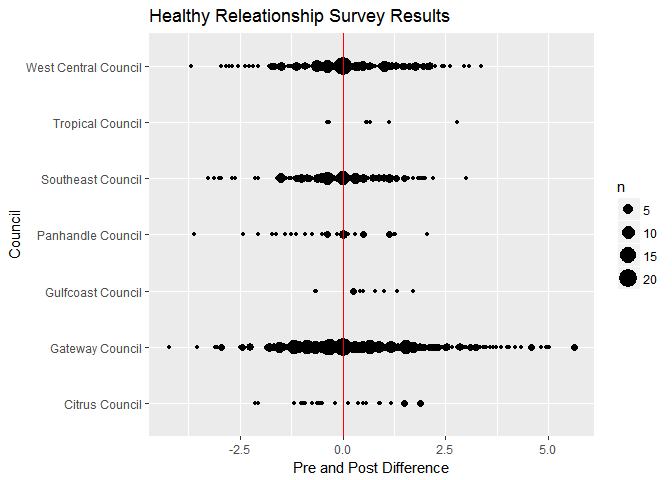

Healthy Relationship History
================
Kevin Gilds, MPA
September 1, 2016

Healthy Relationships
=====================

Post Survey Success
-------------------

| Success |    n|  percent|
|:--------|----:|--------:|
| FALSE   |  203|   20.93%|
| TRUE    |  767|   79.07%|

### Achievement by Council

| council              | Success |    n|  percent|
|:---------------------|:--------|----:|--------:|
| Citrus Council       | TRUE    |   18|   72.00%|
| Gateway Council      | TRUE    |  431|   81.32%|
| Gulfcoast Council    | TRUE    |    8|   80.00%|
| Panhandle Council    | TRUE    |   22|   70.97%|
| Southeast Council    | TRUE    |  104|   71.72%|
| Tropical Council     | TRUE    |    7|  100.00%|
| West Central Council | TRUE    |  177|   79.73%|

### Achievement by Matched Status

| Match | Success |    n|  percent|
|:------|:--------|----:|--------:|
| No    | FALSE   |  179|   20.96%|
| No    | TRUE    |  675|   79.04%|
| Yes   | FALSE   |   24|   20.69%|
| Yes   | TRUE    |   92|   79.31%|

Average Difference between Pre and Post Surveys
-----------------------------------------------

The mean difference between pre and post survey is *0.2078*.

| Match |       mean|
|:------|----------:|
| No    |  0.2253513|
| Yes   |  0.0782328|

### Average Difference by Year

<table style="width:29%;">
<colgroup>
<col width="13%" />
<col width="15%" />
</colgroup>
<thead>
<tr class="header">
<th align="center">Year_Id</th>
<th align="center">hr.diff</th>
</tr>
</thead>
<tbody>
<tr class="odd">
<td align="center">13-14</td>
<td align="center">-0.01182008</td>
</tr>
<tr class="even">
<td align="center">14-15</td>
<td align="center">0.17680798</td>
</tr>
<tr class="odd">
<td align="center">15-16</td>
<td align="center">0.40439394</td>
</tr>
</tbody>
</table>

### Average Difference between Pre and Post by Council

<table style="width:44%;">
<colgroup>
<col width="29%" />
<col width="15%" />
</colgroup>
<thead>
<tr class="header">
<th align="center">council</th>
<th align="center">hr.diff</th>
</tr>
</thead>
<tbody>
<tr class="odd">
<td align="center">Citrus Council</td>
<td align="center">0.13400000</td>
</tr>
<tr class="even">
<td align="center">Gateway Council</td>
<td align="center">0.37429245</td>
</tr>
<tr class="odd">
<td align="center">Gulfcoast Council</td>
<td align="center">0.49500000</td>
</tr>
<tr class="even">
<td align="center">Panhandle Council</td>
<td align="center">-0.33548387</td>
</tr>
<tr class="odd">
<td align="center">Southeast Council</td>
<td align="center">-0.11017241</td>
</tr>
<tr class="even">
<td align="center">Tropical Council</td>
<td align="center">0.72142857</td>
</tr>
<tr class="odd">
<td align="center">West Central Council</td>
<td align="center">0.07286036</td>
</tr>
</tbody>
</table>

Post Survey Average Score
-------------------------

<table style="width:28%;">
<colgroup>
<col width="13%" />
<col width="13%" />
</colgroup>
<thead>
<tr class="header">
<th align="center">Year_Id</th>
<th align="center">Post</th>
</tr>
</thead>
<tbody>
<tr class="odd">
<td align="center">13-14</td>
<td align="center">4.597071</td>
</tr>
<tr class="even">
<td align="center">14-15</td>
<td align="center">4.627681</td>
</tr>
<tr class="odd">
<td align="center">15-16</td>
<td align="center">4.935152</td>
</tr>
</tbody>
</table>

| Match |      Post|
|:------|---------:|
| No    |  4.736680|
| Yes   |  4.636853|

    ## [1] TRUE
