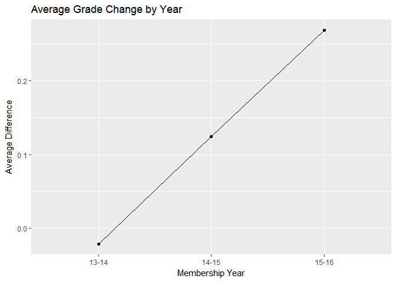

language\_arts\_history
================
Kevin Gilds, MPA
September 24, 2016

Language Arts Grade Data
========================

The number of students that were matched from the past 3 Membership Years is **1763**

The percent of students with a successful outcome is **76.23%**

-   The number of students who increased their grade or maintained at least a C grade is **1344**

    -   The number of students with a final grade of C and increased their grade is **524**

    -   The number of students who maintained at least a C grade is **820**

The percent of students who went from failing to passing is **75.77%**

-   The number of students who started with a failing grade is **194**

-   The number of students who increased grade from failing to passing **147**

### Achievement by Council

| council              | Success |    n|  percent|
|:---------------------|:--------|----:|--------:|
| Citrus Council       | TRUE    |   70|   62.50%|
| Gateway Council      | TRUE    |  553|   81.93%|
| Gulfcoast Council    | TRUE    |   22|   48.89%|
| Panhandle Council    | TRUE    |  208|   69.57%|
| Southeast Council    | TRUE    |  311|   82.06%|
| Tropical Council     | TRUE    |   10|   66.67%|
| West Central Council | TRUE    |  170|   71.43%|

| Match | Success |     n|  percent|
|:------|:--------|-----:|--------:|
| No    | TRUE    |  1141|   75.76%|
| Yes   | TRUE    |   203|   78.99%|

<table style="width:33%;">
<colgroup>
<col width="13%" />
<col width="19%" />
</colgroup>
<thead>
<tr class="header">
<th align="center">Year_Id</th>
<th align="center">Grade_Change</th>
</tr>
</thead>
<tbody>
<tr class="odd">
<td align="center">13-14</td>
<td align="center">-0.02154399</td>
</tr>
<tr class="even">
<td align="center">14-15</td>
<td align="center">0.12423780</td>
</tr>
<tr class="odd">
<td align="center">15-16</td>
<td align="center">0.26909091</td>
</tr>
</tbody>
</table>



<table style="width:62%;">
<colgroup>
<col width="29%" />
<col width="13%" />
<col width="19%" />
</colgroup>
<thead>
<tr class="header">
<th align="center">council</th>
<th align="center">Year_Id</th>
<th align="center">Grade_Change</th>
</tr>
</thead>
<tbody>
<tr class="odd">
<td align="center">Citrus Council</td>
<td align="center">14-15</td>
<td align="center">-0.089743590</td>
</tr>
<tr class="even">
<td align="center">Citrus Council</td>
<td align="center">15-16</td>
<td align="center">-0.029411765</td>
</tr>
<tr class="odd">
<td align="center">Gateway Council</td>
<td align="center">13-14</td>
<td align="center">0.004048583</td>
</tr>
<tr class="even">
<td align="center">Gateway Council</td>
<td align="center">14-15</td>
<td align="center">0.312500000</td>
</tr>
<tr class="odd">
<td align="center">Gateway Council</td>
<td align="center">15-16</td>
<td align="center">0.597014925</td>
</tr>
<tr class="even">
<td align="center">Gulfcoast Council</td>
<td align="center">13-14</td>
<td align="center">-0.444444444</td>
</tr>
<tr class="odd">
<td align="center">Panhandle Council</td>
<td align="center">13-14</td>
<td align="center">-0.306451613</td>
</tr>
<tr class="even">
<td align="center">Panhandle Council</td>
<td align="center">14-15</td>
<td align="center">0.088607595</td>
</tr>
<tr class="odd">
<td align="center">Southeast Council</td>
<td align="center">13-14</td>
<td align="center">0.130434783</td>
</tr>
<tr class="even">
<td align="center">Southeast Council</td>
<td align="center">14-15</td>
<td align="center">0.092920354</td>
</tr>
<tr class="odd">
<td align="center">Southeast Council</td>
<td align="center">15-16</td>
<td align="center">0.095238095</td>
</tr>
<tr class="even">
<td align="center">Tropical Council</td>
<td align="center">14-15</td>
<td align="center">0.214285714</td>
</tr>
<tr class="odd">
<td align="center">Tropical Council</td>
<td align="center">15-16</td>
<td align="center">-0.125000000</td>
</tr>
<tr class="even">
<td align="center">West Central Council</td>
<td align="center">13-14</td>
<td align="center">0.119047619</td>
</tr>
<tr class="odd">
<td align="center">West Central Council</td>
<td align="center">14-15</td>
<td align="center">0.090163934</td>
</tr>
<tr class="even">
<td align="center">West Central Council</td>
<td align="center">15-16</td>
<td align="center">-0.148148148</td>
</tr>
</tbody>
</table>


``` r
setwd("C:/Users/kevin/Dropbox/GetReal/Data/sqlite")


getReal_db<- dbConnect(SQLite(), dbname="outcome_history.sqlite") #established connection with d

dbWriteTable(conn =getReal_db, name= "langarts_history", value= lang_history, row.names=FALSE, overwrite=TRUE)
```

    ## [1] TRUE
