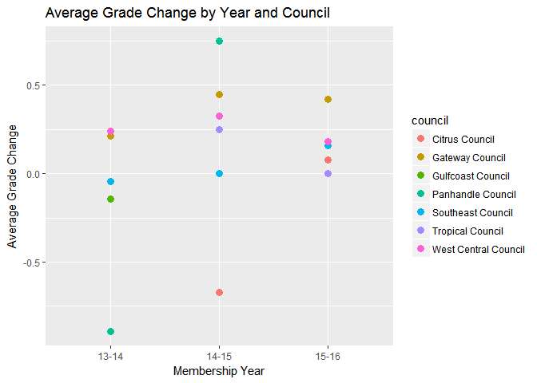

reading\_arts\_history
================
Kevin Gilds, MPA
September 24, 2016

Reading Grade Data
==================

The number of students that were matched from the past 3 Membership Years is **798**

The percent of students with a successful outcome is **75.69%**

-   The number of students who increased their grade or maintained at least a C grade is **604**

    -   The number of students with a final grade of C and increased their grade is **274**

    -   The number of students who maintained at least a C grade is **330**

The percent of students who went from failing to passing is **74.16%**

-   The number of students who started with a failing grade **89**

-   The number of students who increased grade from failing to passing **66**

### Achievement by Council

| council              | Success |    n|  percent|
|:---------------------|:--------|----:|--------:|
| Citrus Council       | TRUE    |   27|   52.94%|
| Gateway Council      | TRUE    |  259|   83.01%|
| Gulfcoast Council    | TRUE    |   14|   66.67%|
| Panhandle Council    | TRUE    |   24|   54.55%|
| Southeast Council    | TRUE    |  104|   71.23%|
| Tropical Council     | TRUE    |    6|   85.71%|
| West Central Council | TRUE    |  170|   78.34%|

| Match | Success |    n|  percent|
|:------|:--------|----:|--------:|
| No    | TRUE    |  552|   75.62%|
| Yes   | TRUE    |   52|   76.47%|

Grade Changes from baseline to final
====================================

### Grade change by Matched Status

| Match |  Grade\_Change|
|:------|--------------:|
| No    |      0.1390411|
| Yes   |      0.5441176|

### Grade Change by Year

<table style="width:33%;">
<colgroup>
<col width="13%" />
<col width="19%" />
</colgroup>
<thead>
<tr class="header">
<th align="center">Year_Id</th>
<th align="center">Grade_Change</th>
</tr>
</thead>
<tbody>
<tr class="odd">
<td align="center">13-14</td>
<td align="center">0.0000000</td>
</tr>
<tr class="even">
<td align="center">14-15</td>
<td align="center">0.2079365</td>
</tr>
<tr class="odd">
<td align="center">15-16</td>
<td align="center">0.2607143</td>
</tr>
</tbody>
</table>

<table style="width:62%;">
<colgroup>
<col width="29%" />
<col width="13%" />
<col width="19%" />
</colgroup>
<thead>
<tr class="header">
<th align="center">council</th>
<th align="center">Year_Id</th>
<th align="center">Grade_Change</th>
</tr>
</thead>
<tbody>
<tr class="odd">
<td align="center">Citrus Council</td>
<td align="center">14-15</td>
<td align="center">-0.67105263</td>
</tr>
<tr class="even">
<td align="center">Citrus Council</td>
<td align="center">15-16</td>
<td align="center">0.07692308</td>
</tr>
<tr class="odd">
<td align="center">Gateway Council</td>
<td align="center">13-14</td>
<td align="center">0.21195652</td>
</tr>
<tr class="even">
<td align="center">Gateway Council</td>
<td align="center">14-15</td>
<td align="center">0.44690265</td>
</tr>
<tr class="odd">
<td align="center">Gateway Council</td>
<td align="center">15-16</td>
<td align="center">0.42056075</td>
</tr>
<tr class="even">
<td align="center">Gulfcoast Council</td>
<td align="center">13-14</td>
<td align="center">-0.14285714</td>
</tr>
<tr class="odd">
<td align="center">Panhandle Council</td>
<td align="center">13-14</td>
<td align="center">-0.89285714</td>
</tr>
<tr class="even">
<td align="center">Panhandle Council</td>
<td align="center">14-15</td>
<td align="center">0.75000000</td>
</tr>
<tr class="odd">
<td align="center">Southeast Council</td>
<td align="center">13-14</td>
<td align="center">-0.04545455</td>
</tr>
<tr class="even">
<td align="center">Southeast Council</td>
<td align="center">14-15</td>
<td align="center">0.00000000</td>
</tr>
<tr class="odd">
<td align="center">Southeast Council</td>
<td align="center">15-16</td>
<td align="center">0.15625000</td>
</tr>
<tr class="even">
<td align="center">Tropical Council</td>
<td align="center">14-15</td>
<td align="center">0.25000000</td>
</tr>
<tr class="odd">
<td align="center">Tropical Council</td>
<td align="center">15-16</td>
<td align="center">0.00000000</td>
</tr>
<tr class="even">
<td align="center">West Central Council</td>
<td align="center">13-14</td>
<td align="center">0.23750000</td>
</tr>
<tr class="odd">
<td align="center">West Central Council</td>
<td align="center">14-15</td>
<td align="center">0.32738095</td>
</tr>
<tr class="even">
<td align="center">West Central Council</td>
<td align="center">15-16</td>
<td align="center">0.18279570</td>
</tr>
</tbody>
</table>

